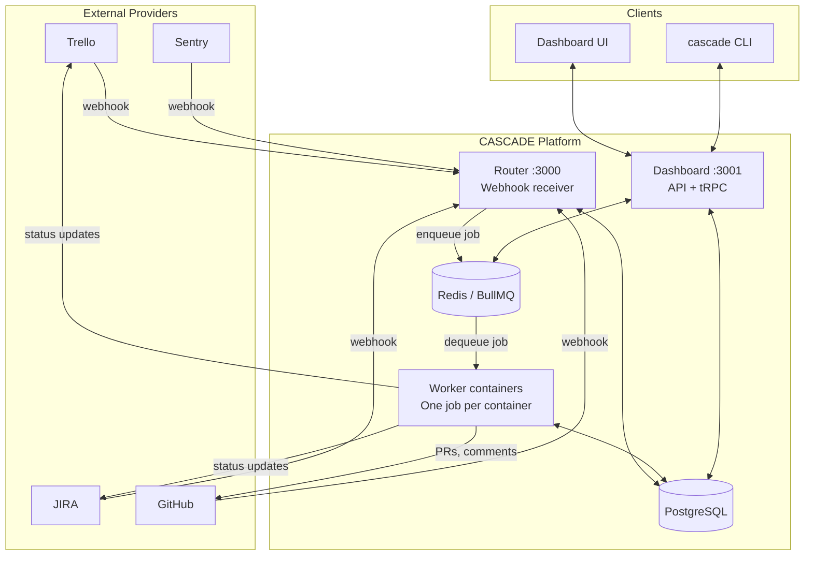
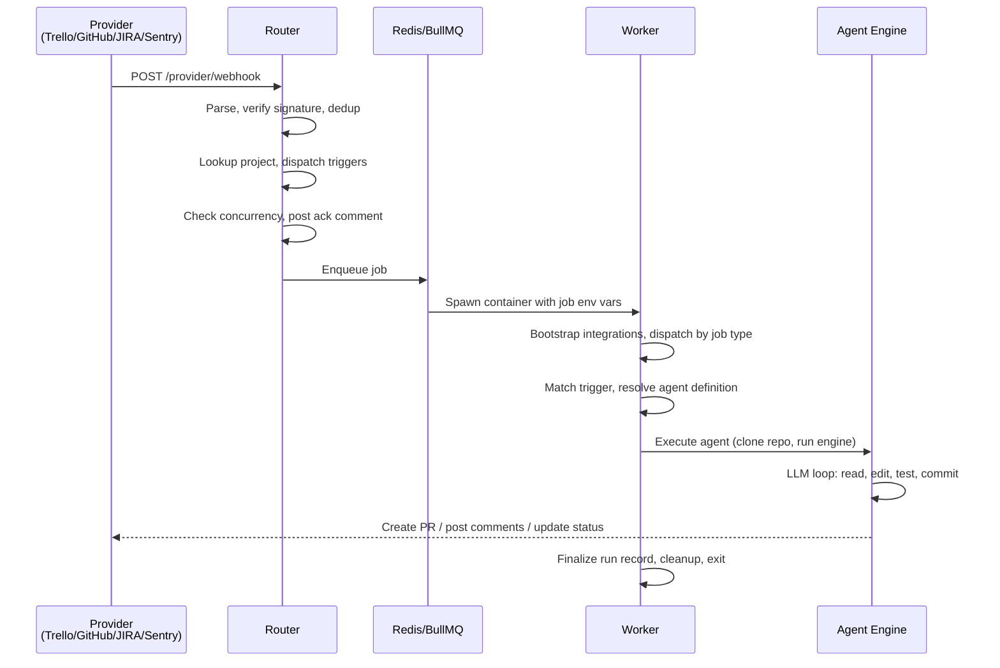

# CASCADE Architecture

CASCADE is a PM-to-Code automation platform that connects project management tools (Trello, JIRA), source control (GitHub), and monitoring (Sentry) to AI-powered agents that autonomously implement features, review PRs, debug failures, and manage backlogs. Webhooks from external providers flow through a router, get queued in Redis, and are processed by ephemeral worker containers that run agents against cloned repositories.

> **Relationship to CLAUDE.md**: `CLAUDE.md` is the operational reference (commands, env vars, how-to). This document and its deep-dives cover the *system design* — how components fit together and why.

## System Overview

See also: [`docs/architecture.d2`](architecture.d2) for the D2 source diagram.

## Service Topology

| Service | Entry Point | Default Port | Responsibility |
|---------|-------------|-------------|----------------|
| **Router** | `src/router/index.ts` | 3000 | Receive webhooks, verify signatures, run trigger dispatch, enqueue jobs to Redis, manage worker containers |
| **Worker** | `src/worker-entry.ts` | N/A (ephemeral) | Process one job per container — run trigger handlers, execute agents, exit on completion |
| **Dashboard** | `src/dashboard.ts` | 3001 | tRPC API for web UI and CLI, session auth, serve frontend static files in self-hosted mode |

## End-to-End Request Flow

The canonical path from webhook to pull request:

## Architectural Patterns

**Registry pattern** — Integrations, triggers, engines, PM providers, and capabilities all use registries (singleton maps populated at bootstrap). Infrastructure code looks up by key with no provider-specific branching.

**Capability-driven tool resolution** — Agent YAML definitions declare required capabilities (`fs:read`, `pm:write`, `scm:pr`). At runtime, capabilities are resolved against available integrations to determine which gadgets (tools) the agent receives.

**Two-tier credential resolution** — In the router and dashboard, credentials are read from the `project_credentials` database table. In workers, the router pre-loads credentials as environment variables to avoid giving workers direct DB access to secrets.

**Dual-persona GitHub model** — Each project uses two GitHub bot accounts (implementer and reviewer) to prevent feedback loops. Agent type determines which persona token is used.

**YAML-based agent definitions** — Agents are defined declaratively in YAML files specifying identity, capabilities, triggers, prompts, and lifecycle hooks. Definitions resolve via three tiers: in-memory cache, database, then YAML files on disk.

**AsyncLocalStorage credential scoping** — Provider clients (GitHub, Trello, JIRA) use Node.js `AsyncLocalStorage` to scope credentials per-request, preventing cross-request credential leakage.

## Directory Map

| Directory | Purpose |
|-----------|---------|
| `src/router/` | Webhook receiver, BullMQ producer, worker container management |
| `src/webhook/` | Shared webhook handler factory, parsers, signature verification, logging |
| `src/triggers/` | Event-to-agent routing: TriggerRegistry, TriggerHandler implementations |
| `src/agents/` | Agent definitions (YAML), profiles, capabilities, prompt templates |
| `src/backends/` | LLM execution engines: Claude Code, LLMist, Codex, OpenCode |
| `src/gadgets/` | Tool implementations agents use (file ops, PM, SCM, alerting, shell) |
| `src/integrations/` | Unified integration interfaces, registry, bootstrap |
| `src/pm/` | PM abstraction layer: provider interface, Trello/JIRA adapters, lifecycle |
| `src/github/` | GitHub API client, dual-persona model, PR operations |
| `src/trello/` | Trello API client |
| `src/jira/` | JIRA API client (jira.js wrapper) |
| `src/sentry/` | Sentry API client, alerting integration |
| `src/config/` | Configuration provider, caching, credential resolution, integration roles |
| `src/db/` | Drizzle ORM schema, repositories, migrations |
| `src/api/` | tRPC routers for dashboard API |
| `src/cli/` | Two CLIs: `cascade` (dashboard) and `cascade-tools` (agent tools) |
| `src/utils/` | Logging, repo cloning, lifecycle/watchdog, env scrubbing |
| `src/types/` | Shared TypeScript types |
| `src/queue/` | BullMQ queue helpers |

## Deep-Dive Documents

1. [Services and Deployment](./architecture/01-services.md) — Three-service architecture, startup sequences, container model
2. [Webhook Pipeline](./architecture/02-webhook-pipeline.md) — Handler factory, platform adapters, processing pipeline
3. [Trigger System](./architecture/03-trigger-system.md) — TriggerRegistry, handlers, config resolution, context pipeline
4. [Agent System](./architecture/04-agent-system.md) — YAML definitions, profiles, capabilities, prompts, hooks
5. [Engine Backends](./architecture/05-engine-backends.md) — AgentEngine interface, archetypes, execution adapter
6. [Integration Layer](./architecture/06-integration-layer.md) — IntegrationModule, registry, categories, provider implementations
7. [Gadgets](./architecture/07-gadgets.md) — Capability-to-gadget mapping, built-in tools, cascade-tools CLI
8. [Configuration and Credentials](./architecture/08-config-credentials.md) — Config provider, credential resolution, encryption
9. [Database](./architecture/09-database.md) — Schema, ER diagram, repositories, migrations
10. [Resilience](./architecture/10-resilience.md) — Watchdog, concurrency controls, rate limiting, retry, loop prevention
