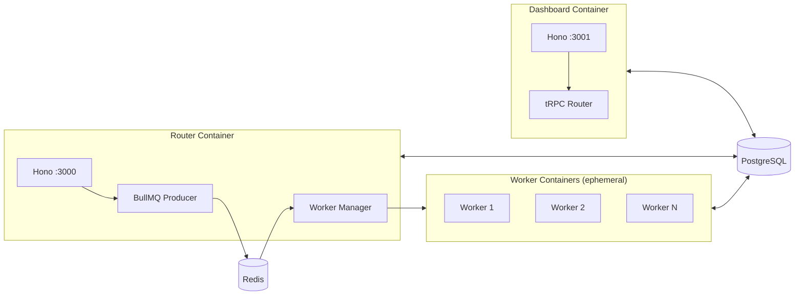

# Services and Deployment

CASCADE runs as three independent services. There is no monolithic server mode — each service has a distinct entry point, lifecycle, and scaling model.



## Router

**Entry point**: `src/router/index.ts`
**Default port**: 3000

The router is the webhook ingestion point. It receives HTTP POST requests from external providers, processes them through a multi-step pipeline, and enqueues jobs to Redis for worker containers.

### Webhook endpoints

| Route | Provider | Notes |
|-------|----------|-------|
| `POST /trello/webhook` | Trello | HEAD/GET returns 200 for Trello's verification |
| `POST /github/webhook` | GitHub | Injects `X-GitHub-Event` header into payload |
| `POST /jira/webhook` | JIRA | HEAD/GET returns 200 for JIRA verification |
| `POST /sentry/webhook/:projectId` | Sentry | Project ID in URL for unambiguous routing |
| `GET /health` | Internal | Queue stats, active worker count |

### Startup sequence

Module-load phase (runs at import time, before `startRouter()`):
1. `registerBuiltInEngines()` — register engine settings schemas (required before any `loadConfig()`)
2. `createTriggerRegistry()` + `registerBuiltInTriggers()` — populate trigger handlers

`startRouter()` async phase:
3. `seedAgentDefinitions()` — sync built-in YAML definitions to database
4. `initAgentMessages()` — load ack message templates
5. `initPrompts()` — load prompt templates
6. `startCancelListener()` — listen for run cancellation requests
7. `startWorkerProcessor()` — begin polling BullMQ for jobs and spawning containers
8. `serve()` — start Hono HTTP server

### Key modules

| File | Purpose |
|------|---------|
| `webhook-processor.ts` | Generic 12-step pipeline (see [02-webhook-pipeline](./02-webhook-pipeline.md)) |
| `platform-adapter.ts` | `RouterPlatformAdapter` interface |
| `adapters/` | Per-provider adapter implementations |
| `worker-manager.ts` | Spawns/monitors Docker worker containers |
| `queue.ts` | BullMQ `addJob()`, queue stats |
| `action-dedup.ts` | In-memory deduplication of webhook deliveries |
| `work-item-lock.ts` | Prevents concurrent agents on the same work item |
| `agent-type-lock.ts` | Agent-type concurrency limits |
| `cancel-listener.ts` | Listens for run cancellation via BullMQ events |
| `webhookVerification.ts` | HMAC signature verification per provider |

## Worker

**Entry point**: `src/worker-entry.ts`
**Port**: None (ephemeral container, no HTTP server)

Workers are stateless, one-job-per-container processes spawned by the router's worker manager. Each worker reads its job from environment variables, processes it, and exits.

### Environment variables

The router passes job data to workers via Docker container env vars:

| Variable | Purpose |
|----------|---------|
| `JOB_ID` | Unique job identifier |
| `JOB_TYPE` | `trello`, `github`, `jira`, `sentry`, `manual-run`, `retry-run`, `debug-analysis` |
| `JOB_DATA` | JSON-encoded job payload |
| `CASCADE_CREDENTIAL_KEYS` | Comma-separated list of credential env var names |
| Individual credential vars | Pre-loaded project credentials (e.g., `GITHUB_TOKEN_IMPLEMENTER`) |

### Job types

```typescript
type JobData =
  | TrelloJobData      // Trello webhook payload
  | GitHubJobData      // GitHub webhook payload
  | JiraJobData        // JIRA webhook payload
  | SentryJobData      // Sentry webhook payload
  | ManualRunJobData   // Dashboard-initiated run
  | RetryRunJobData    // Retry a failed run
  | DebugAnalysisJobData; // Post-mortem debug analysis
```

### Startup sequence

1. `loadEnvConfigSafe()` — load `.cascade/env` if present
2. `getDb()` — eagerly initialize DB connection (caches pool before env scrub)
3. `registerBuiltInEngines()` — register engine settings schemas (before `loadConfig()`)
4. `loadConfig()` — cache project config from database
5. `seedAgentDefinitions()` — sync built-in YAML definitions to database
6. `initAgentMessages()` — load ack message templates
7. `initPrompts()` — load prompt templates
8. `scrubSensitiveEnv()` — remove `DATABASE_URL` and other secrets from `process.env`
9. `createTriggerRegistry()` + `registerBuiltInTriggers()` — populate trigger handlers
10. `dispatchJob()` — route to the appropriate handler based on `JOB_TYPE`

The security scrub in step 8 prevents agent engines (which execute arbitrary LLM-generated commands) from accessing database credentials. Note that trigger registration (step 9) happens after the scrub — it only needs the in-memory config, not the database.

### Dispatch flow

`dispatchJob()` switches on the job type:
- **Webhook jobs** (`trello`, `github`, `jira`, `sentry`) — call the provider-specific webhook processor, which re-runs trigger dispatch and executes the matched agent
- **Dashboard jobs** (`manual-run`, `retry-run`, `debug-analysis`) — call `processDashboardJob()`, which loads project config and invokes the appropriate runner

## Dashboard

**Entry point**: `src/dashboard.ts`
**Default port**: 3001

The dashboard serves the tRPC API consumed by both the web frontend and the `cascade` CLI. In self-hosted mode, it also serves the built frontend as static files.

### Routes

| Route | Purpose |
|-------|---------|
| `POST /api/auth/login` | Email/password authentication |
| `POST /api/auth/logout` | Session invalidation |
| `/trpc/*` | tRPC API endpoints |
| `GET /health` | Service health check |
| `/*` (static) | Frontend files from `dist/web/` (self-hosted mode only) |

### Startup sequence

Module-load phase (runs at import time, before `startDashboard()`):
1. `registerBuiltInEngines()` — register engine settings schemas
2. CORS middleware, logging middleware registered on Hono app
3. Auth routes mounted (`/api/auth/login`, `/api/auth/logout`)
4. tRPC router mounted with session-based context resolution
5. Static file serving (if `dist/web/` exists)

`startDashboard()` async phase:
6. `initPrompts()` — load prompt templates
7. `serve()` — start Hono HTTP server

### tRPC context

Every tRPC request builds a context containing:
- `user` — resolved from session cookie via `resolveUserFromSession()`
- `effectiveOrgId` — computed from user's org membership or `x-org-context` header

Procedure types enforce auth levels: `publicProcedure`, `protectedProcedure`, `adminProcedure`, `superAdminProcedure`.
