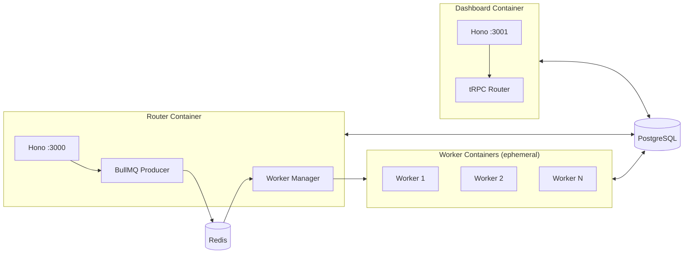

# Services and Deployment

CASCADE runs as three independent services. There is no monolithic server mode — each service has a distinct entry point, lifecycle, and scaling model.


```mermaid
graph LR
    subgraph Router["Router Container"]
        R_Hono["Hono :3000"]
        R_BullMQ["BullMQ Producer"]
        R_WM["Worker Manager"]
    end

    subgraph Workers["Worker Containers (ephemeral)"]
        W1["Worker 1"]
        W2["Worker 2"]
        WN["Worker N"]
    end

    subgraph Dashboard["Dashboard Container"]
        D_Hono["Hono :3001"]
        D_tRPC["tRPC Router"]
    end

    Redis[(Redis)]
    DB[(PostgreSQL)]

    R_Hono --> R_BullMQ --> Redis
    R_WM --> Workers
    Redis --> R_WM

    D_Hono --> D_tRPC
    Dashboard <--> DB
    Router <--> DB
    Workers <--> DB
```

## Router

**Entry point**: `src/router/index.ts`
**Default port**: 3000

The router is the webhook ingestion point. It receives HTTP POST requests from external providers, processes them through a multi-step pipeline, and enqueues jobs to Redis for worker containers.

### Webhook endpoints

| Route | Provider | Notes |
|-------|----------|-------|
| `POST /trello/webhook` | Trello | HEAD/GET returns 200 for Trello's verification |
| `POST /github/webhook` | GitHub | Injects `X-GitHub-Event` header into payload |
| `POST /jira/webhook` | JIRA | HEAD/GET returns 200 for JIRA verification |
| `POST /linear/webhook` | Linear | HMAC-SHA256 via `linear-signature` header |
| `POST /sentry/webhook/:projectId` | Sentry | Project ID in URL for unambiguous routing |
| `GET /health` | Internal | Queue stats, active worker count |

### Startup sequence

Module-load phase (runs at import time, before `startRouter()`):
1. `registerBuiltInEngines()` — register engine settings schemas (required before any `loadConfig()`)
2. `createTriggerRegistry()` + `registerBuiltInTriggers()` — populate trigger handlers

`startRouter()` async phase:
3. `seedAgentDefinitions()` — sync built-in YAML definitions to database
4. `initAgentMessages()` — load ack message templates
5. `initPrompts()` — load prompt templates
6. `startCancelListener()` — listen for run cancellation requests
7. `startWorkerProcessor()` — begin polling BullMQ for jobs and spawning containers
8. `serve()` — start Hono HTTP server

### Key modules

| File | Purpose |
|------|---------|
| `webhook-processor.ts` | Generic 12-step pipeline (see [02-webhook-pipeline](./02-webhook-pipeline.md)) |
| `platform-adapter.ts` | `RouterPlatformAdapter` interface |
| `adapters/` | Per-provider adapter implementations |
| `worker-manager.ts` | BullMQ worker processor orchestration, capacity-slot waiting, and dispatch retry classification |
| `container-manager.ts` | Compatibility facade that assembles worker metadata/env and coordinates Docker worker spawn fallback |
| `worker-container-launcher.ts` | Docker worker create/start/wait wiring, active-worker registration, and router timeout timer setup |
| `worker-spawn-settings.ts` | Docker-free worker image, snapshot-reuse, timeout, and container-name resolution |
| `worker-exit-handler.ts` / `worker-timeouts.ts` | Post-exit cleanup/diagnostics and router-side timeout cancellation internals |
| `queue.ts` | BullMQ `addJob()`, queue stats |
| `action-dedup.ts` | In-memory deduplication of webhook deliveries |
| `work-item-lock.ts` | Prevents concurrent agents on the same work item |
| `agent-type-lock.ts` | Agent-type concurrency limits |
| `cancel-listener.ts` | Listens for run cancellation via BullMQ events |
| `webhookVerification.ts` | HMAC signature verification per provider |

## Worker

**Entry point**: `src/worker-entry.ts`
**Port**: None (ephemeral container, no HTTP server)

Workers are stateless, one-job-per-container processes spawned by the router's worker manager. Each worker reads its job from environment variables, processes it, and exits.

### Environment variables

The router passes job data to workers via Docker container env vars:

| Variable | Purpose |
|----------|---------|
| `JOB_ID` | Unique job identifier |
| `JOB_TYPE` | `trello`, `github`, `jira`, `linear`, `sentry`, `manual-run`, `retry-run`, `debug-analysis` |
| `JOB_DATA` | JSON-encoded job payload; GitHub jobs include `mergeabilityRecheckAttempt` (mergeability re-check) or `checkSuiteRecheckAttempt` (check-suite Actions-API-lag re-check) in this payload for deferred re-checks |
| `CASCADE_CREDENTIAL_KEYS` | Comma-separated list of credential env var names |
| Individual credential vars | Pre-loaded project credentials (e.g., `GITHUB_TOKEN_IMPLEMENTER`) |

### Job types

```typescript
type JobData =
  | TrelloJobData      // Trello webhook payload
  | GitHubJobData      // GitHub webhook payload
  | JiraJobData        // JIRA webhook payload
  | LinearJobData      // Linear webhook payload
  | SentryJobData      // Sentry webhook payload
  | ManualRunJobData   // Dashboard-initiated run
  | RetryRunJobData    // Retry a failed run
  | DebugAnalysisJobData; // Post-mortem debug analysis
```

### Startup sequence

1. `loadEnvConfigSafe()` — load `.cascade/env` if present
2. `getDb()` — eagerly initialize DB connection (caches pool before env scrub)
3. `registerBuiltInEngines()` — register engine settings schemas (before `loadConfig()`)
4. `loadConfig()` — cache project config from database
5. `seedAgentDefinitions()` — sync built-in YAML definitions to database
6. `initAgentMessages()` — load ack message templates
7. `initPrompts()` — load prompt templates
8. `scrubSensitiveEnv()` — remove `DATABASE_URL` and other secrets from `process.env`
9. `createTriggerRegistry()` + `registerBuiltInTriggers()` — populate trigger handlers
10. `dispatchJob()` — route to the appropriate handler based on `JOB_TYPE`

The security scrub in step 8 prevents agent engines (which execute arbitrary LLM-generated commands) from accessing database credentials. Note that trigger registration (step 9) happens after the scrub — it only needs the in-memory config, not the database.

### Dispatch flow

`dispatchJob()` switches on the job type:
- **Webhook jobs** (`trello`, `github`, `jira`, `linear`, `sentry`) — call the provider-specific webhook processor, which re-runs trigger dispatch and executes the matched agent
- **Dashboard jobs** (`manual-run`, `retry-run`, `debug-analysis`) — call `processDashboardJob()`, which loads project config and invokes the appropriate runner

### Repository checkout

Workers clone the target repository at runtime (`src/agents/shared/repository.ts` → `src/utils/repo.ts`); nothing from the host is mounted. When the job carries a `prNumber`, `setupRepository` fetches `+refs/pull/<N>/head:refs/remotes/pr/<N>` from `origin`, checks out `pr/<N>` detached, and — when `headSha` is also set — verifies that `git rev-parse HEAD` matches. This works for same-repo and external-fork PRs alike; the legacy `prBranch` field is kept for log readability but does not drive checkout, because fork branches do not exist on `origin` and a by-name checkout silently 404s. Any non-zero git exit throws — there is no warn-and-continue.

## Dashboard

**Entry point**: `src/dashboard.ts`
**Default port**: 3001

The dashboard serves the tRPC API consumed by both the web frontend and the `cascade` CLI. In self-hosted mode, it also serves the built frontend as static files.

### Routes

| Route | Purpose |
|-------|---------|
| `POST /api/auth/login` | Email/password authentication |
| `POST /api/auth/logout` | Session invalidation |
| `/trpc/*` | tRPC API endpoints |
| `GET /health` | Service health check |
| `/*` (static) | Frontend files from `dist/web/` (self-hosted mode only) |

### Startup sequence

Module-load phase (runs at import time, before `startDashboard()`):
1. `registerBuiltInEngines()` — register engine settings schemas
2. CORS middleware, logging middleware registered on Hono app
3. Auth routes mounted (`/api/auth/login`, `/api/auth/logout`)
4. tRPC router mounted with session-based context resolution
5. Static file serving (if `dist/web/` exists)

`startDashboard()` async phase:
6. `initPrompts()` — load prompt templates
7. `serve()` — start Hono HTTP server

### tRPC context

Every tRPC request builds a context containing:
- `user` — resolved from session cookie via `resolveUserFromSession()` (also returns the session's `active_org_id`)
- `effectiveOrgId` — computed by `computeEffectiveOrgId()`. For a **superadmin** the `x-org-context` header selects any org (unchanged). For everyone else the session's `active_org_id` governs, validated against `org_memberships`, and falls back to the user's home org (`users.org_id`) when there is no active org or the membership is gone — so deleting an org / losing a membership never logs a user out (spec 021 plan 2).
- `token` — the session token, used by `auth.setActiveOrg` to switch the session's active org

Procedure types enforce auth levels: `publicProcedure`, `protectedProcedure`, `adminProcedure`, `superAdminProcedure`. User-management permission checks additionally consume `resolveActorRoleInOrg()` so the caller's **per-org** membership role — not the global `users.role` — governs (an org admin who switches into an org where they are only a member cannot act as an admin there).

### Cross-process debug-analysis status

Post-mortem [debug analysis](./03-trigger-system.md) runs in a **separate worker container** from the dashboard API that reports its progress. Its running/failed lifecycle is therefore tracked in a **durable, cross-process** signal — the `debug_analysis_status` table (see [09-database](./09-database.md)) — rather than an in-process flag, which would be invisible across the process boundary. An earlier worker-local in-memory `Set` (`debug-status.ts`) was removed for exactly this reason (MNG-1667); status is now read from the table **uniformly in queue mode and local dev**, with no separate non-queue path.

**Status writers** — every `triggerDebugAnalysis()` run (the automatic post-failure path and the manual "Run Analysis" button alike) marks `running` around the analysis, clears the row on success (a persisted `debug_analyses` content row is then the `completed` signal), and marks `failed` on a catchable in-process error. The dashboard additionally marks `running` at manual-trigger time to cover the enqueue→spawn window.

**Status reads** — `runs.getDebugAnalysisStatus` derives status from `debug_analysis_status` plus the `debug_analyses` content row; the re-trigger `CONFLICT` guard reads the same `debug_analysis_status` row (active-`running` check only). BullMQ job state is deliberately **not** consulted: the dashboard job reaches `completed` at container *spawn*, not at analysis completion (the debug agent then runs for tens of seconds to minutes), so it cannot represent a still-running analysis. Read precedence: active `running` → `completed` (a persisted analysis wins) → `failed` → `idle`. A `running` row older than `DEBUG_ANALYSIS_RUNNING_STALE_MS` (2h, comfortably above the 30-min worker timeout) is treated as stale `idle`, so a crashed/OOM-killed worker never wedges the run as permanently `running`. `failed` covers catchable in-process errors only; a hard kill (watchdog/OOM) leaves the `running` row to self-stale to `idle`.

**Deterministic job id (dedup, not status)** — in queue mode the manual trigger enqueues the `debug-analysis` dashboard job under the deterministic id `debug-analysis-<runId>` (`debugAnalysisJobId()` in `src/queue/client.ts`). One job per analyzed run makes the queue self-deduplicating: a re-run removes any prior terminal job and re-submits the same id, and a near-simultaneous second trigger that slips past the guard cannot spawn a duplicate worker container (which would double LLM cost and post a duplicate PM comment). The automatic post-run path instead calls the runner in-process (fire-and-forget) and does not use this job id, but writes the same durable status.
