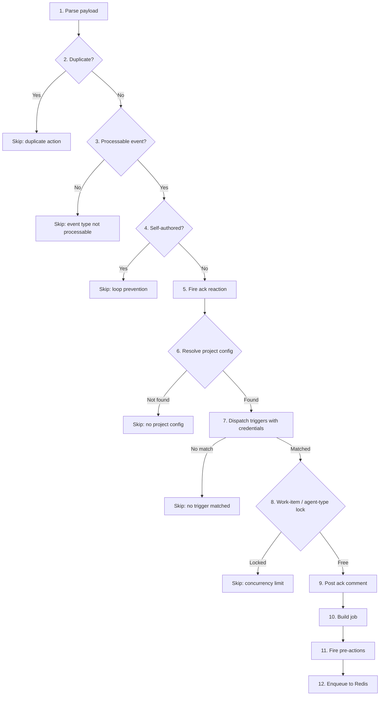

# Webhook Pipeline

Webhooks from external providers (Trello, GitHub, JIRA, Sentry) are processed through a two-layer system: a **webhook handler factory** that handles HTTP concerns, and a **router platform adapter** that implements the business logic pipeline.

## Webhook Handler Factory

`src/webhook/webhookHandlers.ts` — `createWebhookHandler()`

The factory creates Hono route handlers with a standard lifecycle:

```
HTTP POST → Parse payload → Verify signature → Process webhook → Log result → Return 200/4xx
```

Each webhook endpoint provides a `WebhookHandlerConfig`:

```typescript
interface WebhookHandlerConfig {
  source: string;                    // 'trello' | 'github' | 'jira' | 'sentry'
  parsePayload: (c: Context) => ParseResult;
  verifySignature?: (ctx, rawBody, projectId?) => VerificationResult | null;
  processWebhook: (payload, eventType?, headers?) => Promise<WebhookLogOverrides>;
}
```

The factory handles:
- Payload parsing with per-provider parsers (`src/webhook/webhookParsers.ts`)
- Optional signature verification (`src/webhook/signatureVerification.ts`)
- Fire-and-forget acknowledgment reactions
- Webhook logging to `webhook_logs` table (`src/webhook/webhookLogging.ts`)
- Error handling (parse failures → 400, signature failures → 401)

### Platform Parsers

| Parser | Source | Event type extraction |
|--------|--------|----------------------|
| `parseGitHubPayload()` | JSON or form-encoded body | `X-GitHub-Event` header |
| `parseTrelloPayload()` | JSON body | `action.type` field |
| `parseJiraPayload()` | JSON body | `webhookEvent` field |
| `parseSentryPayload()` | JSON body | `Sentry-Hook-Resource` header |

## Platform Adapters

`src/router/platform-adapter.ts` — `RouterPlatformAdapter` interface

Each provider implements this interface to plug into the generic `processRouterWebhook()` pipeline:

```typescript
interface RouterPlatformAdapter {
  readonly type: string;
  parseWebhook(payload: unknown): Promise<ParsedWebhookEvent | null>;
  isProcessableEvent(event: ParsedWebhookEvent): boolean;
  isSelfAuthored(event: ParsedWebhookEvent, payload: unknown): Promise<boolean>;
  sendReaction(event: ParsedWebhookEvent, payload: unknown): void;
  resolveProject(event: ParsedWebhookEvent): Promise<RouterProjectConfig | null>;
  dispatchWithCredentials(event, payload, project, triggerRegistry): Promise<TriggerResult | null>;
  postAck(event, payload, project, agentType, triggerResult): Promise<AckResult | null>;
  buildJob(event, payload, project, triggerResult, ackResult): CascadeJob;
  firePreActions?(job, payload): void;
}
```

### Normalized event

All platforms normalize their webhook payload into a `ParsedWebhookEvent`:

```typescript
interface ParsedWebhookEvent {
  projectIdentifier: string;  // Board ID, repo name, JIRA project key
  eventType: string;          // Human-readable event descriptor
  workItemId?: string;        // Card ID, PR number, issue key
  isCommentEvent: boolean;    // Whether this needs ack reaction
  actionId?: string;          // Platform-specific ID for dedup
}
```

### Provider adapters

| Adapter | File | Project lookup key |
|---------|------|--------------------|
| `TrelloRouterAdapter` | `src/router/adapters/trello.ts` | `boardId` |
| `GitHubRouterAdapter` | `src/router/adapters/github.ts` | `repoFullName` |
| `JiraRouterAdapter` | `src/router/adapters/jira.ts` | JIRA project key |
| `SentryRouterAdapter` | `src/router/adapters/sentry.ts` | CASCADE `projectId` (from URL) |

## The 12-Step Pipeline

`src/router/webhook-processor.ts` — `processRouterWebhook()`



### Step details

1. **Parse** — Adapter normalizes raw payload into `ParsedWebhookEvent`
2. **Dedup** — Check in-memory set of recently processed `actionId`s (`action-dedup.ts`)
3. **Filter** — Adapter's `isProcessableEvent()` checks event type relevance
4. **Self-check** — Adapter's `isSelfAuthored()` detects bot's own actions (loop prevention)
5. **Reaction** — Fire-and-forget emoji reaction on the source event
6. **Resolve config** — Look up project by platform identifier (board ID, repo, etc.)
7. **Dispatch triggers** — Within credential scope, call `TriggerRegistry.dispatch()` to find matching agent
8. **Concurrency** — Check work-item lock (`work-item-lock.ts`) and agent-type concurrency (`agent-type-lock.ts`)
9. **Ack comment** — Post an acknowledgment comment to the work item or PR
10. **Build job** — Package trigger result + payload + ack info into a `CascadeJob`
11. **Pre-actions** — Optional fire-and-forget actions (e.g., GitHub eyes reaction)
12. **Enqueue** — Add job to BullMQ Redis queue; mark work item and agent type as enqueued

### Concurrency controls

| Mechanism | File | Purpose |
|-----------|------|---------|
| Action dedup | `action-dedup.ts` | Prevent processing same webhook delivery twice |
| Work-item lock | `work-item-lock.ts` | Prevent concurrent agents on the same card/issue |
| Agent-type lock | `agent-type-lock.ts` | Configurable `max_concurrency` per agent type per project |

All locks are in-memory with TTL expiry. They are conservative (enqueue-time only) — the worker performs its own verification before executing.

## Signature Verification

`src/router/webhookVerification.ts`

Each provider's verification function checks for a stored `webhook_secret` credential and validates the signature header:

| Provider | Header | Algorithm |
|----------|--------|-----------|
| GitHub | `X-Hub-Signature-256` | HMAC-SHA256 |
| Trello | Custom verification | Trello-specific |
| JIRA | `X-Hub-Signature` | HMAC-SHA256 |
| Sentry | `Sentry-Hook-Signature` | HMAC-SHA256 |

If no webhook secret is configured for a project, verification is skipped (returns `null`).
