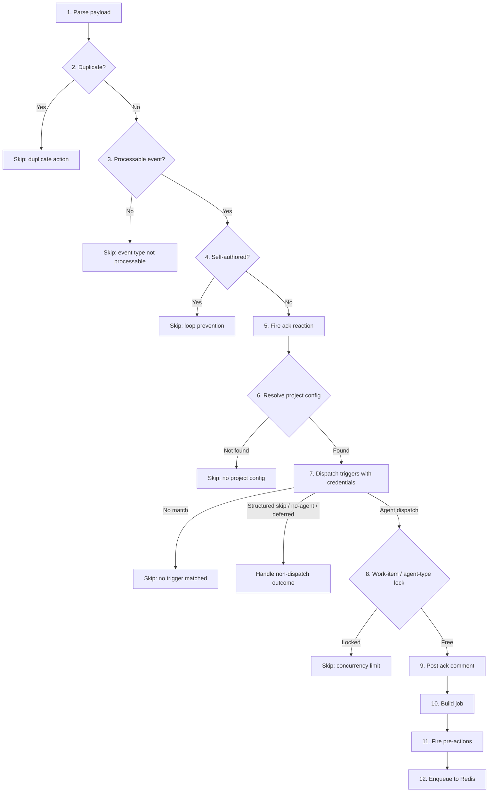

# Webhook Pipeline

Webhooks from external providers (Trello, JIRA, Linear, GitHub, Sentry) are processed through a two-layer system: a **webhook handler factory** that handles HTTP concerns, and a **router platform adapter** that implements the business logic pipeline.

## Webhook Handler Factory

`src/webhook/webhookHandlers.ts` — `createWebhookHandler()`

The factory creates Hono route handlers with a standard lifecycle:

```
HTTP POST → Parse payload → Verify signature → Process webhook → Log result → Return 200/4xx
```

Each webhook endpoint provides a `WebhookHandlerConfig`:

```typescript
interface WebhookHandlerConfig {
  source: string;                    // 'trello' | 'github' | 'jira' | 'linear' | 'sentry'
  parsePayload: (c: Context) => ParseResult;
  verifySignature?: (ctx, rawBody, projectId?) => VerificationResult | null;
  processWebhook: (payload, eventType?, headers?) => Promise<WebhookLogOverrides>;
}
```

The factory handles:
- Payload parsing with per-provider parsers (`src/webhook/webhookParsers.ts`)
- Optional signature verification (`src/webhook/signatureVerification.ts`)
- Fire-and-forget acknowledgment reactions
- Webhook logging to `webhook_logs` table (`src/webhook/webhookLogging.ts`)
- Error handling (parse failures → 400, signature failures → 401)

### Platform Parsers

| Parser | Source | Event type extraction |
|--------|--------|----------------------|
| `parseGitHubPayload()` | JSON or form-encoded body | `X-GitHub-Event` header |
| `parseTrelloPayload()` | JSON body | `action.type` field |
| `parseJiraPayload()` | JSON body | `webhookEvent` field |
| `parseLinearPayload()` | JSON body | `type` field |
| `parseSentryPayload()` | JSON body | `Sentry-Hook-Resource` header |

## Platform Adapters

`src/router/platform-adapter.ts` — `RouterPlatformAdapter` interface

Each provider implements this interface to plug into the generic `processRouterWebhook()` pipeline:

```typescript
interface RouterPlatformAdapter {
  readonly type: string;
  parseWebhook(payload: unknown): Promise<ParsedWebhookEvent | null>;
  isProcessableEvent(event: ParsedWebhookEvent): boolean;
  isSelfAuthored(event: ParsedWebhookEvent, payload: unknown): Promise<boolean>;
  sendReaction(event: ParsedWebhookEvent, payload: unknown): void;
  resolveProject(event: ParsedWebhookEvent): Promise<RouterProjectConfig | null>;
  dispatchWithCredentials(event, payload, project, triggerRegistry): Promise<TriggerResult | null>;
  postAck(event, payload, project, agentType, triggerResult): Promise<AckResult | null>;
  buildJob(event, payload, project, triggerResult, ackResult): CascadeJob;
  firePreActions?(job, payload): void;
}
```

### Normalized event

All platforms normalize their webhook payload into a `ParsedWebhookEvent`:

```typescript
interface ParsedWebhookEvent {
  projectIdentifier: string;  // Board ID, repo name, JIRA project key
  eventType: string;          // Human-readable event descriptor
  workItemId?: string;        // Card ID, PR number, issue key
  isCommentEvent: boolean;    // Whether this needs ack reaction
  actionId?: string;          // Platform-specific ID for dedup
}
```

### Provider adapters

| Adapter | File | Project lookup key |
|---------|------|--------------------|
| `TrelloRouterAdapter` | `src/router/adapters/trello.ts` | `boardId` |
| `GitHubRouterAdapter` | `src/router/adapters/github.ts` | `repoFullName` |
| `JiraRouterAdapter` | `src/router/adapters/jira.ts` | JIRA project key |
| `LinearRouterAdapter` | `src/router/adapters/linear.ts` | Linear team ID |
| `SentryRouterAdapter` | `src/router/adapters/sentry.ts` | CASCADE `projectId` (from URL) |

## The 12-Step Pipeline

`src/router/webhook-processor.ts` — `processRouterWebhook()`


```mermaid
flowchart TD
    A[1. Parse payload] --> B{2. Duplicate?}
    B -->|Yes| SKIP1[Skip: duplicate action]
    B -->|No| C{3. Processable event?}
    C -->|No| SKIP2[Skip: event type not processable]
    C -->|Yes| D{4. Self-authored?}
    D -->|Yes| SKIP3[Skip: loop prevention]
    D -->|No| E[5. Fire ack reaction]
    E --> F{6. Resolve project config}
    F -->|Not found| SKIP4[Skip: no project config]
    F -->|Found| G[7. Dispatch triggers with credentials]
    G -->|No match| SKIP5[Skip: no trigger matched]
    G -->|Structured skip / no-agent / deferred| OUTCOME[Handle non-dispatch outcome]
    G -->|Agent dispatch| H{8. Work-item / agent-type lock}
    H -->|Locked| SKIP6[Skip: concurrency limit]
    H -->|Free| I[9. Post ack comment]
    I --> J[10. Build job]
    J --> K[11. Fire pre-actions]
    K --> L[12. Enqueue to Redis]
```

### Step details

1. **Parse** — Adapter normalizes raw payload into `ParsedWebhookEvent`
2. **Dedup** — Check in-memory set of recently processed `actionId`s (`action-dedup.ts`)
3. **Filter** — Adapter's `isProcessableEvent()` checks event type relevance
4. **Self-check** — Adapter's `isSelfAuthored()` detects bot's own actions (loop prevention)
5. **Reaction** — Fire-and-forget emoji reaction on the source event
6. **Resolve config** — Look up project by platform identifier (board ID, repo, etc.)
7. **Dispatch triggers** — Within credential scope, call `TriggerRegistry.dispatch()` to find a matching result. PM router adapters also wrap dispatch in `withPMScopeForDispatch(fullProject, dispatch)` so shared PM gates can resolve the active provider.
8. **Concurrency** — Check work-item lock (`work-item-lock.ts`) and agent-type concurrency (`agent-type-lock.ts`)
9. **Ack comment** — Post an acknowledgment comment to the work item or PR
10. **Build job** — Package trigger result + payload + ack info into a `CascadeJob`
11. **Pre-actions** — Optional fire-and-forget actions (e.g., GitHub eyes reaction)
12. **Enqueue** — Add job to BullMQ Redis queue; mark work item and agent type as enqueued

### Router outcomes

`src/router/webhook-trigger-outcomes.ts` normalizes trigger results into stable router decisions:

| Trigger result | Router behavior | Decision reason shape |
|----------------|-----------------|-----------------------|
| `null` from registry | No handler claimed the event | `No trigger matched for event` |
| `agentType: null` + `skipReason` | Handler claimed the event but intentionally self-skipped | `Trigger <handler> skipped: <message>` |
| `agentType: null` + `deferredRecheck` | Schedule a coalesced delayed bare job and exit | `Deferred re-check scheduled: <coalesceKey>` |
| `agentType: null` without skip/defer | Side-effect-only trigger completed | `Trigger completed without agent (PM operation)` |
| `agentType` + `coalesceKey` and coalescing enabled | Schedule a delayed coalesced dispatch | `Coalesced dispatch scheduled: <agent> agent for work item <id>` |
| `agentType` without coalescing | Post ack, build job, enqueue now | `Job queued: <agent> agent for work item <id>` |
| Immediate-dispatch or PM coalesced-dispatch Redis failure | Call `onBlocked` and leave a failure reason | `Failed to enqueue job to Redis` or `Failed to schedule coalesced job to Redis` |
| Deferred re-check Redis failure | Capture Sentry under `deferred_recheck_schedule_failure`; skip `onBlocked`; treat as if scheduled | `Deferred re-check scheduled: <coalesceKey>` |

Structured skip is intentionally different from bare `null`: it preserves the handler's reason in webhook logs instead of collapsing expected non-dispatch decisions into "no trigger matched."

### Coalescing and deferred re-check

PM status-change dispatches can include a `coalesceKey`, normally `${projectId}:${workItemId}`. When `PM_COALESCE_WINDOW_MS` is positive, the router schedules a delayed job via `scheduleCoalescedJob`; a newer dispatch with the same key supersedes the pending one and releases the superseded job's in-memory locks. PM ack comments are deferred to job fire time for coalesced jobs so superseded work does not leave orphan comments.

Deferred re-check also uses `scheduleCoalescedJob` and exits without dispatch locks or an ack comment. The bare re-dispatch on job fire is currently **GitHub-only**: `GitHubRouterAdapter.buildJob()` strips `triggerResult` and sets `mergeabilityRecheckAttempt: 1`, so the GitHub worker re-dispatches through the trigger registry to evaluate fresh provider state. Non-GitHub adapters (Trello, JIRA, Linear, Sentry) embed `triggerResult` in the job regardless of `deferredRecheck`, so their workers return the pre-resolved `agentType: null` result directly without re-dispatching. If a deferred re-check schedule call fails, the router captures Sentry under `deferred_recheck_schedule_failure` and still returns `Deferred re-check scheduled` — it does not call `onBlocked`. GitHub mergeability uses this when `mergeable` is still `null` after the synchronous retry budget; if the re-check still cannot resolve state, the GitHub worker records `mergeability_recheck_exhausted` and stops rather than re-queueing indefinitely.

### Concurrency controls

| Mechanism | File | Purpose |
|-----------|------|---------|
| Action dedup | `action-dedup.ts` | Prevent processing same webhook delivery twice |
| Work-item lock | `work-item-lock.ts` | Prevent duplicate same-agent runs on the same card/issue |
| Agent-type lock | `agent-type-lock.ts` | Configurable `max_concurrency` per agent type per project |
| Lock-state classifier | `lock-state-classifier.ts` | Explains blocked webhooks as queued, awaiting worker slot, or wedged lock |

All locks are in-memory with TTL expiry. Work-item locks are scoped by `(projectId, workItemId, agentType)`: duplicate runs of the same agent are blocked, but different agent types can run concurrently on the same work item. When a lock rejects a webhook, logs distinguish `Awaiting worker slot` from `Work item locked (no active dispatch)`; the latter is a wedged-lock canary and captures to Sentry.

The work-item lock decision vocabulary is stable by design:

- `Job queued: ...` means the router successfully registered a dispatch and enqueued or scheduled work.
- `Awaiting worker slot: ...` means the same work item and agent type already have an active queued/waiting/running dispatch.
- `Work item locked (no active dispatch): ...` means the lock-state classifier could not correlate the lock with queued or running work. This is a wedged-lock canary, not normal backpressure.

## Signature Verification

`src/router/webhookVerification.ts`

Each provider's verification function checks for a stored `webhook_secret` credential and validates the signature header:

| Provider | Header | Algorithm |
|----------|--------|-----------|
| GitHub | `X-Hub-Signature-256` | HMAC-SHA256 |
| Trello | Custom verification | Trello-specific |
| JIRA | `X-Hub-Signature` | HMAC-SHA256 |
| Linear | `linear-signature` | HMAC-SHA256 (hex, no prefix) |
| Sentry | `Sentry-Hook-Signature` | HMAC-SHA256 |

If no webhook secret is configured for a project, verification is skipped (returns `null`).
