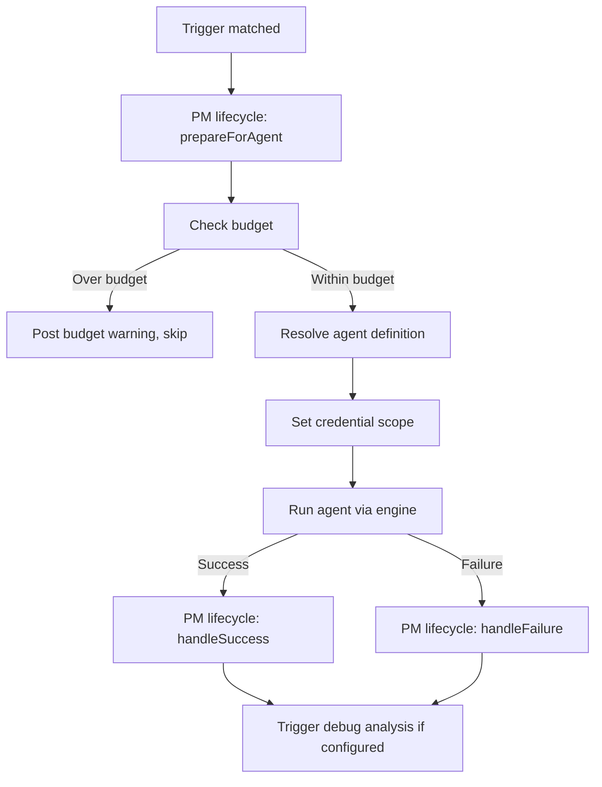

# Trigger System

The trigger system routes webhook events to the appropriate agent. When a webhook arrives, the router builds a `TriggerContext` and calls `TriggerRegistry.dispatch()` to find the first matching handler. The matched handler returns a `TriggerResult` specifying which agent to run and with what input.

## TriggerRegistry

`src/triggers/registry.ts`

A simple ordered list of handlers with first-match-wins dispatch:

```typescript
class TriggerRegistry {
  register(handler: TriggerHandler): void;
  dispatch(ctx: TriggerContext): Promise<TriggerResult | null>;
  getHandlers(): TriggerHandler[];
}
```

`dispatch()` iterates handlers in registration order. For each handler:
1. Call `matches(ctx)` — if `false`, skip
2. Call `handle(ctx)` — if it returns a `TriggerResult`, return it
3. If `handle()` returns `null`, continue to next handler

## TriggerHandler

`src/triggers/types.ts`

```typescript
interface TriggerHandler {
  name: string;
  description: string;
  matches(ctx: TriggerContext): boolean;
  handle(ctx: TriggerContext): Promise<TriggerResult | null>;
}
```

### TriggerContext

```typescript
interface TriggerContext {
  project: ProjectConfig;
  source: TriggerSource;          // 'trello' | 'github' | 'jira' | 'sentry'
  payload: unknown;                // Raw webhook payload
  personaIdentities?: PersonaIdentities;  // GitHub bot identities
}
```

### TriggerResult

```typescript
interface TriggerResult {
  agentType: string | null;        // Which agent to run
  agentInput: AgentInput;          // Input data for the agent
  workItemId?: string;
  workItemUrl?: string;
  workItemTitle?: string;
  prNumber?: number;
  prUrl?: string;
  prTitle?: string;
  waitForChecks?: boolean;         // Poll CI before starting
  onBlocked?: () => void;          // Cleanup if job can't be enqueued
}
```

## Built-in Triggers

Registration happens in `src/triggers/builtins.ts`, which delegates to per-platform `register.ts` files:

```typescript
function registerBuiltInTriggers(registry: TriggerRegistry): void {
  registerTrelloTriggers(registry);
  registerJiraTriggers(registry);
  registerGitHubTriggers(registry);
  registerSentryTriggers(registry);
}
```

### Trello triggers (`src/triggers/trello/`)

| Handler | Event | Agent |
|---------|-------|-------|
| `TrelloCommentMentionTrigger` | Bot mentioned in comment | Varies by context |
| `TrelloStatusChangedSplittingTrigger` | Card → Splitting list | `splitting` |
| `TrelloStatusChangedPlanningTrigger` | Card → Planning list | `planning` |
| `TrelloStatusChangedTodoTrigger` | Card → Todo list | `implementation` |
| `TrelloStatusChangedBacklogTrigger` | Card → Backlog list | `backlog-manager` |
| `TrelloStatusChangedMergedTrigger` | Card → Merged list | `backlog-manager` |
| `ReadyToProcessLabelTrigger` | "cascade-ready" label added | `splitting` |

### JIRA triggers (`src/triggers/jira/`)

| Handler | Event | Agent |
|---------|-------|-------|
| `JiraCommentMentionTrigger` | Bot mentioned in comment | Varies |
| `JiraStatusChangedTrigger` | Issue status transition | Per-status mapping |
| `JiraLabelAddedTrigger` | "cascade-ready" label added | `splitting` |

### GitHub triggers (`src/triggers/github/`)

| Handler | Event | Agent |
|---------|-------|-------|
| `CheckSuiteSuccessTrigger` | CI passed | `review` (with `authorMode` param) |
| `CheckSuiteFailureTrigger` | CI failed | `respond-to-ci` |
| `PrReviewSubmittedTrigger` | Review with changes_requested | `respond-to-review` |
| `ReviewRequestedTrigger` | Bot requested as reviewer | `review` |
| `PrOpenedTrigger` | PR opened | `review` |
| `PrCommentMentionTrigger` | Bot @mentioned in PR comment | `respond-to-pr-comment` |
| `PrMergedTrigger` | PR merged | PM status update (no agent) |
| `PrReadyToMergeTrigger` | PR approved + checks pass | PM status update (no agent) |
| `PrConflictDetectedTrigger` | Merge conflict on PR | `resolve-conflicts` |

### Sentry triggers (`src/triggers/sentry/`)

| Handler | Event | Agent |
|---------|-------|-------|
| `AlertingIssueTrigger` | Sentry issue alert | `alerting` |
| `AlertingMetricTrigger` | Sentry metric alert | `alerting` |

## Trigger Configuration

### Event format

Triggers use category-prefixed events: `{category}:{event-name}`
- `pm:status-changed`, `pm:label-added`
- `scm:check-suite-success`, `scm:pr-review-submitted`, `scm:review-requested`
- `alerting:issue-created`, `alerting:metric-alert`

### Config resolution

`src/triggers/config-resolver.ts`

Each trigger handler calls `isTriggerEnabled()` to check if it should fire. Resolution follows a three-tier cascade:

1. **Database overrides** — `agent_trigger_configs` table entries per project/agent/event
2. **Definition defaults** — `defaultEnabled` and default parameters from YAML definitions
3. **Legacy fallback** — `project_integrations.triggers` JSONB (migrated automatically)

### Context pipeline

Each trigger in a YAML agent definition can declare a `contextPipeline` — an ordered list of context-fetching steps that run before the agent starts:

| Step | Purpose |
|------|---------|
| `directoryListing` | List repository file structure |
| `contextFiles` | Read key project files (README, etc.) |
| `squint` | Query Squint semantic index |
| `workItem` | Fetch work item details from PM tool |
| `prepopulateTodos` | Pre-populate todo list from work item checklists |
| `prContext` | Fetch PR details, diff, reviews |
| `prConversation` | Fetch PR comments and review threads |
| `pipelineSnapshot` | Fetch CI pipeline status |
| `alertingIssue` | Fetch Sentry issue and event details |

## Shared Agent Execution

`src/triggers/shared/agent-execution.ts`

After a trigger matches, the shared execution layer handles the agent lifecycle:



This includes:
- PM lifecycle management (move card to "In Progress", post labels)
- Budget checking (`workItemBudgetUsd`)
- Credential scoping via `withCredentials()`
- Agent execution via `runAgent()` (see [05-engine-backends](./05-engine-backends.md))
- Post-run lifecycle (move card to "In Review", link PR, sync checklists)
- Debug analysis triggering on failure
