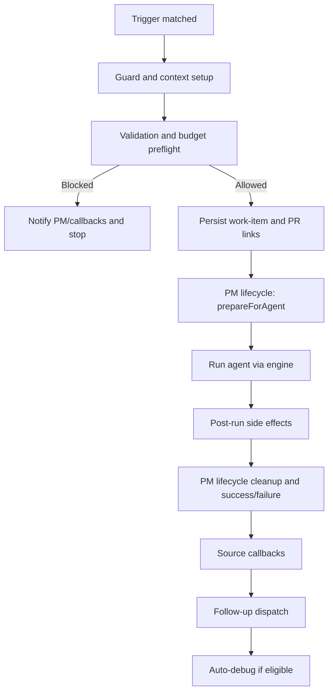

# Trigger System

The trigger system routes webhook events to the appropriate agent. When a webhook arrives, the router builds a `TriggerContext` and calls `TriggerRegistry.dispatch()` to find the first matching handler. The matched handler returns a `TriggerResult` specifying which agent to run and with what input.

## TriggerRegistry

`src/triggers/registry.ts`

A simple ordered list of handlers with first-match-wins dispatch:

```typescript
class TriggerRegistry {
  register(handler: TriggerHandler): void;
  dispatch(ctx: TriggerContext): Promise<TriggerResult | null>;
  getHandlers(): TriggerHandler[];
}
```

`dispatch()` iterates handlers in registration order. For each handler:
1. Call `matches(ctx)` — if `false`, skip
2. Call `handle(ctx)` — if it returns a `TriggerResult`, return it
3. If `handle()` returns `null`, continue to next handler

That makes dispatch first-match-wins for non-null results. A handler should return bare `null` only when it does not claim the event and later handlers should still get a chance. If a handler claims the event but decides not to run an agent, it returns a structured `TriggerResult` with `agentType: null` instead.

## TriggerHandler

`src/triggers/types.ts`

```typescript
interface TriggerHandler {
  name: string;
  description: string;
  matches(ctx: TriggerContext): boolean;
  handle(ctx: TriggerContext): Promise<TriggerResult | null>;
}
```

### TriggerContext

```typescript
interface TriggerContext {
  project: ProjectConfig;
  source: TriggerSource;          // 'trello' | 'github' | 'jira' | 'linear' | 'sentry'
  payload: unknown;                // Raw webhook payload
  personaIdentities?: PersonaIdentities;  // GitHub bot identities
}
```

### TriggerResult

```typescript
interface TriggerResult {
  agentType: string | null;        // Which agent to run
  agentInput: AgentInput;          // Input data for the agent
  workItemId?: string;
  workItemUrl?: string;
  workItemTitle?: string;
  prNumber?: number;
  prUrl?: string;
  prTitle?: string;
  onBlocked?: () => void;          // Cleanup if job can't be enqueued
  skipReason?: {
    handler: string;
    message: string;
  };
  lockKey?: string;                 // Optional work-item lock override
  coalesceKey?: string;             // Optional PM dispatch coalescing key
  deferredRecheck?: {
    delayMs: number;
    coalesceKey: string;
  };                               // Schedule a bare delayed re-dispatch
}
```

## Built-in Triggers

Registration happens in `src/triggers/builtins.ts`. PM providers (Trello, JIRA, Linear) contribute triggers via the manifest registry; SCM and alerting providers use their own `register.ts` functions:

```typescript
function registerBuiltInTriggers(registry: TriggerRegistry): void {
  // PM providers register via the manifest registry (spec 006/009 pattern)
  for (const manifest of listPMProviders()) {
    for (const handler of manifest.triggerHandlers) {
      registry.register(handler);
    }
  }
  registerGitHubTriggers(registry);
  registerSentryTriggers(registry);
}
```

### Trello triggers (`src/triggers/trello/`)

| Handler | Event | Agent |
|---------|-------|-------|
| `TrelloCommentMentionTrigger` | Bot mentioned in comment | Varies by context |
| `TrelloStatusChangedSplittingTrigger` | Card → Splitting list | `splitting` |
| `TrelloStatusChangedPlanningTrigger` | Card → Planning list | `planning` |
| `TrelloStatusChangedTodoTrigger` | Card → Todo list | `implementation` |
| `TrelloStatusChangedBacklogTrigger` | Card → Backlog list | `backlog-manager` |
| `TrelloStatusChangedMergedTrigger` | Card → Merged list | `backlog-manager` |
| `ReadyToProcessLabelTrigger` | "cascade-ready" label added | `splitting` |

### JIRA triggers (`src/triggers/jira/`)

| Handler | Event | Agent |
|---------|-------|-------|
| `JiraCommentMentionTrigger` | Bot mentioned in comment | Varies |
| `JiraStatusChangedTrigger` | Issue status transition | Per-status mapping |
| `JiraLabelAddedTrigger` | "cascade-ready" label added | `splitting` |

### GitHub triggers (`src/triggers/github/`)

| Handler | Event | Agent |
|---------|-------|-------|
| `CheckSuiteSuccessTrigger` | CI passed | `review` (with `authorMode` param) |
| `CheckSuiteFailureTrigger` | CI failed | `respond-to-ci` |
| `PrReviewSubmittedTrigger` | Review with changes_requested | `respond-to-review` |
| `ReviewRequestedTrigger` | Bot requested as reviewer | `review` |
| `PrOpenedTrigger` | PR opened | `review` |
| `PrCommentMentionTrigger` | Bot @mentioned in PR comment | `respond-to-pr-comment` |
| `PrMergedTrigger` | PR merged | PM status update (no agent) |
| `PrReadyToMergeTrigger` | PR approved + checks pass | PM status update (no agent) |
| `PrConflictDetectedTrigger` | Merge conflict on PR | `resolve-conflicts` |

### Linear triggers (`src/triggers/linear/`)

| Handler | Event | Agent |
|---------|-------|-------|
| `LinearCommentMentionTrigger` | Bot @mentioned in issue comment | `respond-to-planning-comment` |
| `LinearStatusChangedTrigger` | Issue state transition | Per-status mapping |
| `LinearReadyToProcessLabelTrigger` | "cascade-ready" label added | `splitting` |

### Sentry triggers (`src/triggers/sentry/`)

| Handler | Event | Agent |
|---------|-------|-------|
| `AlertingIssueTrigger` | Sentry issue alert | `alerting` |
| `AlertingMetricTrigger` | Sentry metric alert | `alerting` |

## Trigger Configuration

### Event format

Triggers use category-prefixed events from `src/triggers/shared/events.ts`. `TRIGGER_EVENTS` is the canonical catalog used by handlers, result builders, trigger configuration, and static tests:

- PM: `pm:status-changed`, `pm:label-added`, `pm:comment-mention`
- SCM: `scm:check-suite-success`, `scm:check-suite-failure`, `scm:pr-review-submitted`, `scm:review-requested`, `scm:pr-opened`, `scm:pr-comment-mention`, `scm:pr-merged`, `scm:pr-ready-to-merge`, `scm:pr-conflict-detected`
- Alerting: `alerting:issue-alert`, `alerting:metric-alert`
- Internal: `internal:auto-chain`

New handlers should import `TRIGGER_EVENTS` instead of adding raw string literals. The static guard in `tests/unit/triggers/trigger-event-consistency.test.ts` fails when a handler gates on one event string and emits a different `agentInput.triggerEvent`.

### Result builders

Shared builders live in `src/triggers/shared/result-builders.ts`, `src/triggers/shared/pm-status.ts`, `src/triggers/shared/pm-label.ts`, and `src/triggers/github/result-builders.ts`.

Use them for new handlers unless there is a concrete reason not to:

- `buildPMDispatchResult`, `buildPMStatusDispatchResult`, and `buildPMLabelDispatchResult` attach canonical PM trigger events, work-item fields, and PM coalescing keys.
- `buildGitHubPRDispatchResult` and the GitHub-specific wrappers attach PR metadata, optional linked PM work-item metadata, and normalized agent input for PR agents.
- `buildNoAgentResult` represents a matched trigger whose side effect is complete without spawning an agent, such as PM status updates after a PR merge.
- `buildSkipResult` or `skip()` represents a matched trigger that intentionally stops dispatch with a human-readable reason.
- `buildDeferredRecheckResult` represents a delayed bare-job re-dispatch.

### Structured skip vs bare `null`

Bare `null` means "this handler did not handle the event; continue registry dispatch." Structured skip means "this handler did handle the event; stop dispatch and record why no agent was queued."

The router preserves structured skips in webhook logs with `Trigger <handler> skipped: <message>`. Use structured skip for disabled trigger config, author-mode gates, self-loop gates, incomplete aggregate check-suite state, missing PR/work-item prerequisites, and similar expected non-dispatch outcomes.

### Deferred re-checks

Handlers that cannot make a final decision yet can return `deferredRecheck: { delayMs, coalesceKey, recheckKind? }` with `agentType: null`. The router schedules a coalesced delayed BullMQ job and exits without spawning an agent.

The bare re-dispatch on job fire is currently **GitHub-only**: `GitHubRouterAdapter.buildJob()` strips `triggerResult` and stamps the right re-check field based on the optional `recheckKind` discriminator. Two re-check kinds exist:

- **Mergeability re-check** (`recheckKind` absent) — `mergeabilityRecheckAttempt: 1` is set on the job. The GitHub worker re-dispatches through the registry for fresh provider state. If the re-check still cannot resolve state, the worker Sentry-captures under `mergeability_recheck_exhausted` and stops (one-shot — no further rescheduling).
- **Check-suite re-check** (`recheckKind: 'check-suite'`) — `checkSuiteRecheckAttempt: 1` is set on the job. If the Actions API is still stale when the job fires, the worker reschedules another coalesced delayed job instead of exhausting, so review/respond-to-ci dispatch stays alive until the API catches up. Used by `check-suite-success` and `check-suite-failure` for the Actions-API-lag case (ucho PR #394/MNG-683, 2026-05-11).

Non-GitHub adapters (Trello, JIRA, Linear, Sentry) embed `triggerResult` in the job regardless of `deferredRecheck`; `resolveTriggerResult()` returns the pre-resolved result directly, skipping registry dispatch. A non-GitHub handler returning `buildDeferredRecheckResult` would therefore schedule a job that reuses the same `agentType: null` result rather than re-evaluating provider state. See `src/triggers/README.md` for the full authoring contract.

### Config resolution

`src/triggers/config-resolver.ts`

Each trigger handler calls `isTriggerEnabled()` to check if it should fire. Resolution follows a three-tier cascade:

1. **Database overrides** — `agent_trigger_configs` table entries per project/agent/event
2. **Definition defaults** — `defaultEnabled` and default parameters from YAML definitions
3. **Legacy fallback** — `project_integrations.triggers` JSONB (migrated automatically)

### Context pipeline

Each trigger in a YAML agent definition can declare a `contextPipeline` — an ordered list of context-fetching steps that run before the agent starts:

| Step | Purpose |
|------|---------|
| `directoryListing` | List repository file structure |
| `contextFiles` | Read key project files (README, etc.) |
| `workItem` | Fetch work item details from PM tool |
| `prepopulateTodos` | Pre-populate todo list from work item checklists |
| `prContext` | Fetch PR details, GitHub changed-file metadata, locally verified compact per-file diffs from `origin/<base>...HEAD`, and CI checks; emit a `SKIPPED FILES` injection when files are omitted (over budget, deleted, binary/no patch, or local diff unavailable) |
| `prConversation` | Fetch PR comments and review threads |
| `pipelineSnapshot` | Fetch CI pipeline status |
| `alertingIssue` | Fetch Sentry issue and event details |

## Shared Agent Execution

`src/triggers/shared/agent-execution.ts`

After a trigger matches, the shared execution layer handles the agent lifecycle. `runAgentExecutionPipeline()` is intentionally a thin facade: it keeps the source-compatible call signature used by PM, GitHub, Sentry, and manual paths, while delegating each execution concern to helper modules under `src/triggers/shared/`.


```mermaid
flowchart TD
    A[Trigger matched] --> B[Guard and context setup]
    B --> C[Validation and budget preflight]
    C -->|Blocked| D[Notify PM/callbacks and stop]
    C -->|Allowed| E[Persist work-item and PR links]
    E --> F[PM lifecycle: prepareForAgent]
    F --> G[Run agent via engine]
    G --> H[Post-run side effects]
    H --> I[PM lifecycle cleanup and success/failure]
    I --> J[Source callbacks]
    J --> K[Follow-up dispatch]
    K --> L[Auto-debug if eligible]
```

This includes:
- Context setup in `agent-execution-runtime.ts`: build the `PMLifecycleManager`, load agent lifecycle hooks, and re-resolve `workItemId` from PR links when a webhook arrived before the DB mapping existed.
- Validation and lifecycle preflight in `agent-execution-lifecycle.ts`: validate PM/SCM integrations, notify PM/callbacks on validation failure, check `workItemBudgetUsd`, and run `prepareForAgent`.
- Work-item and PR traceability in `agent-work-items.ts`: create/update work-item records, maintain PR/work-item links before and after execution, fetch PR titles, and backfill run PR numbers.
- Agent execution in `agent-execution-runtime.ts`: call `runAgent()` with the resolved input plus project, config, and remaining budget.
- Post-run PM behavior in `agent-pm-summary.ts` and `agent-execution-lifecycle.ts`: post review/output summaries to the PM work item, handle artifacts, post budget warnings, clean up processing state, and call `handleSuccess` or `handleFailure`.
- Follow-up dispatch in `agent-execution-followups.ts`: dispatch review after a successful implementation PR once CI is passing and the review dedup key is claimed, and chain backlog-manager after a successful splitting run when the auto label/capacity checks allow it.
- Auto-debug in `agent-auto-debug.ts`: fire-and-forget debug analysis for eligible failed or timed-out runs after callbacks and follow-up dispatch complete.

Credential scoping still happens before the facade runs. PM webhook handling enters provider credentials and PM provider scope before dispatch; GitHub and Sentry use `webhook-execution.ts` / `credential-scope.ts` to inject LLM keys, PM credentials, PM provider scope, and GitHub persona tokens as needed.
