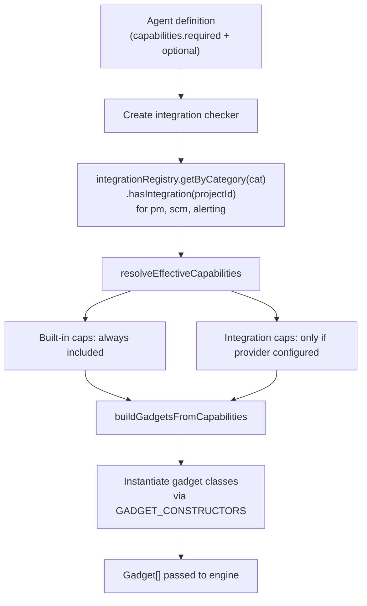

# Agent System

Agents are the core automation units in CASCADE. Each agent is defined declaratively in YAML, specifying its identity, capabilities, triggers, prompts, and lifecycle hooks. At runtime, definitions are compiled into profiles that determine which tools the agent receives and how it interacts with the PM/SCM systems.

## Agent Definitions

`src/agents/definitions/`

### YAML structure

Each built-in agent is a YAML file in `src/agents/definitions/`. Custom agents are stored in the `agent_definitions` database table. The schema is defined in `src/agents/definitions/schema.ts`.

```yaml
identity:
  emoji: "..."
  label: "Implementation"
  roleHint: "Writes code, runs tests, and prepares a pull request"
  initialMessage: "**Implementing changes** — ..."

integrations:
  required: [pm, scm]    # Fail if not configured
  optional: [alerting]    # Use if available

capabilities:
  required:
    - fs:read
    - fs:write
    - shell:exec
    - session:ctrl
    - pm:read
    - pm:write
    - scm:pr
  optional:
    - pm:checklist

triggers:
  - event: pm:status-changed
    label: "Status Changed to Todo"
    defaultEnabled: false
    parameters:
      - name: targetStatus
        type: select
        options: [todo]
        defaultValue: todo
    contextPipeline: [directoryListing, contextFiles, squint, workItem, prepopulateTodos]

prompts:
  taskPrompt: |
    Analyze and process the work item with ID: <%= it.workItemId %>.

hooks:
  trailing:
    scm:
      gitStatus: true
      prStatus: true
    builtin:
      diagnostics: true
      todoProgress: true
      reminder: true
  finish:
    scm:
      requiresPR: true
  lifecycle:
    moveOnPrepare: inProgress
    moveOnSuccess: inReview
    linkPR: true
    syncChecklist: true

hint: >-
  Complete the current todo in as few iterations as possible.
```

### Key schema fields

| Field | Purpose |
|-------|---------|
| `identity` | Agent display info (emoji, label, role hint, initial message) |
| `integrations` | Explicit integration requirements (required/optional categories) |
| `capabilities` | Required and optional capabilities that determine tool access |
| `triggers` | Events that activate this agent, with parameters and context pipelines |
| `prompts.taskPrompt` | Eta template for the agent's task prompt |
| `hooks.trailing` | Info appended to each LLM turn (git status, PR status, diagnostics) |
| `hooks.finish` | Completion requirements (must have PR, must have review, etc.) |
| `hooks.lifecycle` | PM card movement on prepare/success, PR linking, checklist sync |
| `hint` | Persistent guidance injected into the LLM context |
| `strategies` | Engine-specific strategy overrides |
| `gadgetOptions` | Special gadget builder flags (e.g., `includeReviewComments`) |

### Three-tier definition resolution

`src/agents/definitions/loader.ts`

```
1. In-memory cache (fastest, populated on first load)
       ↓ miss
2. Database lookup (agent_definitions table — custom agents)
       ↓ miss
3. YAML file on disk (src/agents/definitions/*.yaml — built-in agents)
```

Key functions:
- `resolveAgentDefinition(agentType)` — single agent, three-tier
- `resolveAllAgentDefinitions()` — merge DB + YAML
- `resolveKnownAgentTypes()` — list all known types

## Built-in Agents

| Agent | Capabilities | Persona | Key Triggers |
|-------|-------------|---------|--------------|
| `implementation` | fs, shell, session, pm, scm:pr | Implementer | `pm:status-changed` (todo) |
| `splitting` | fs, session, pm | Implementer | `pm:status-changed`, `pm:label-added` |
| `planning` | fs, session, pm | Implementer | `pm:status-changed` (planning) |
| `review` | fs, shell, scm:read, scm:review | Reviewer | `scm:check-suite-success`, `scm:review-requested` |
| `respond-to-review` | fs, shell, session, pm, scm | Implementer | `scm:pr-review-submitted` |
| `respond-to-ci` | fs, shell, session, scm | Implementer | `scm:check-suite-failure` |
| `respond-to-pr-comment` | fs, shell, session, scm | Implementer | `scm:pr-comment-mention` |
| `respond-to-planning-comment` | fs, session, pm | Implementer | `pm:comment-mention` |
| `backlog-manager` | fs, session, pm, scm:read | Implementer | `pm:status-changed` (backlog, merged) |
| `resolve-conflicts` | fs, shell, session, scm | Implementer | `scm:pr-conflict-detected` |
| `alerting` | fs, shell, session, alerting, scm | Implementer | `alerting:issue-created`, `alerting:metric-alert` |
| `debug` | fs, session, pm | Implementer | `internal:debug-analysis` |

## Capabilities

`src/agents/capabilities/`

Capabilities are the bridge between agent definitions and concrete tools. The system maps capabilities to gadgets (for SDK engines) and SDK tools (for native-tool engines).

### Registry

`src/agents/capabilities/registry.ts`

```typescript
const CAPABILITIES = [
  // Built-in (always available)
  'fs:read', 'fs:write', 'shell:exec', 'session:ctrl',
  // PM integration
  'pm:read', 'pm:write', 'pm:checklist',
  // SCM integration
  'scm:read', 'scm:ci-logs', 'scm:comment', 'scm:review', 'scm:pr',
  // Alerting integration
  'alerting:read',
] as const;
```

Each capability maps to a `CapabilityDefinition`:

```typescript
interface CapabilityDefinition {
  integration: IntegrationCategory | null;  // null = built-in
  description: string;
  gadgetNames: string[];     // LLMist gadget classes
  sdkToolNames: string[];    // Claude Code SDK tool names
  cliToolNames: string[];    // cascade-tools CLI commands
}
```

### Resolution flow

`src/agents/capabilities/resolver.ts`



- Built-in capabilities (`fs:*`, `shell:*`, `session:*`) are always available
- Integration capabilities (`pm:*`, `scm:*`, `alerting:*`) require the corresponding integration to be configured for the project
- Optional capabilities degrade gracefully — missing integrations are noted in the system prompt

## Prompts

`src/agents/prompts/`

Agent prompts are built using the [Eta](https://eta.js.org/) template engine.

### Template context

The `PromptContext` object passed to templates includes:
- `workItemId`, `workItemUrl`, `workItemTitle` — from trigger result
- `prNumber`, `prUrl`, `prBranch` — for SCM-focused agents
- `projectConfig` — full project configuration
- `agentType` — the running agent type
- `capabilities` — resolved capability list
- `hint` — persistent guidance from definition

### Prompt partials

Organizations can customize agent prompts via **prompt partials** — named template fragments stored in the `prompt_partials` database table. Partials are Eta includes (`<%~ include('partialName') %>`) that override default content when a custom version exists.

Managed via:
- Dashboard: Settings > Prompts
- CLI: `cascade prompts set-partial`, `cascade prompts reset-partial`

## Hooks

### Trailing hooks

Appended to each LLM turn as ephemeral context:

| Hook | Purpose |
|------|---------|
| `scm.gitStatus` | Current git status (uncommitted changes) |
| `scm.prStatus` | PR state, review status, CI checks |
| `builtin.diagnostics` | TypeScript/lint errors in recently edited files |
| `builtin.todoProgress` | Current todo list progress |
| `builtin.reminder` | Iteration budget and guidance reminders |

### Finish hooks

Completion requirements verified before the agent can finish:

| Hook | Purpose |
|------|---------|
| `scm.requiresPR` | Agent must have created/updated a PR |
| `scm.requiresReview` | Agent must have submitted a review |
| `scm.requiresPushedChanges` | Agent must have pushed commits |

### Lifecycle hooks

PM card management during agent execution:

| Hook | Purpose |
|------|---------|
| `moveOnPrepare` | Move card to status on agent start (e.g., "In Progress") |
| `moveOnSuccess` | Move card to status on success (e.g., "In Review") |
| `linkPR` | Link the created PR to the work item |
| `syncChecklist` | Sync todo list back to PM card checklists |

## Agent Profiles

`src/agents/definitions/profiles.ts`

At runtime, a definition is compiled into an `AgentProfile` — the operational interface used by the execution pipeline:

- `filterTools(allTools)` — filter available tools based on capabilities
- `allCapabilities` — resolved capability list
- `fetchContext(params)` — run context pipeline steps
- `buildTaskPrompt(input)` — render Eta task prompt template
- `getLlmistGadgets()` — instantiate gadgets for LLMist engine
- `finishHooks` — PR/review/push requirements
- `lifecycleHooks` — PM card movement rules
