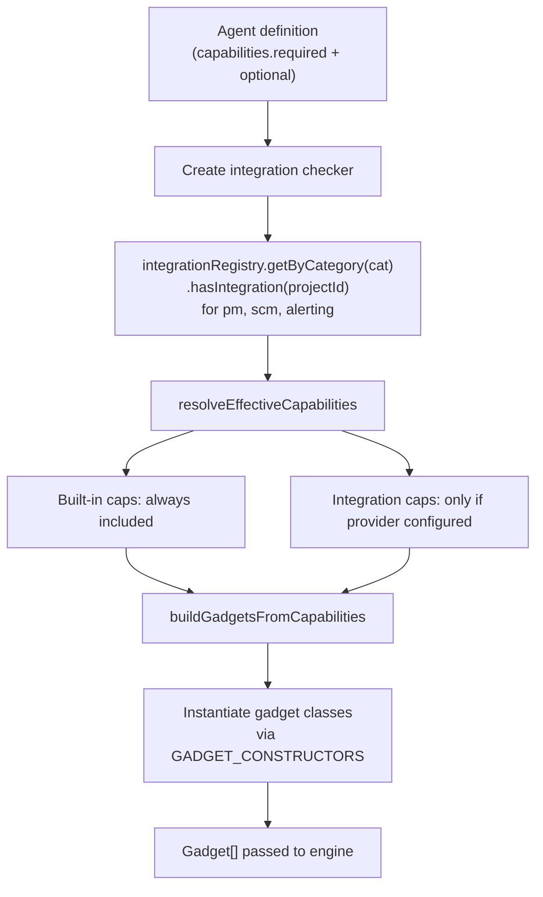

# Agent System

Agents are the core automation units in CASCADE. Each agent is defined declaratively in YAML, specifying its identity, capabilities, triggers, prompts, and lifecycle hooks. At runtime, definitions are compiled into profiles that determine which tools the agent receives and how it interacts with the PM/SCM systems.

## Agent Definitions

`src/agents/definitions/`

### YAML structure

Each built-in agent is a YAML file in `src/agents/definitions/`. Custom agents are stored in the `agent_definitions` database table. The schema is defined in `src/agents/definitions/schema.ts`.

```yaml
identity:
  emoji: "..."
  label: "Implementation"
  roleHint: "Writes code, runs tests, and prepares a pull request"
  initialMessage: "**Implementing changes** — ..."

integrations:
  required: [pm, scm]    # Fail if not configured
  optional: [alerting]    # Use if available

capabilities:
  required:
    - fs:read
    - fs:write
    - shell:exec
    - session:ctrl
    - pm:read
    - pm:write
    - scm:pr
  optional:
    - pm:checklist

triggers:
  - event: pm:status-changed
    label: "Status Changed to Todo"
    defaultEnabled: false
    parameters:
      - name: targetStatus
        type: select
        options: [todo]
        defaultValue: todo
    contextPipeline: [directoryListing, contextFiles, workItem, prepopulateTodos]

prompts:
  taskPrompt: |
    Analyze and process the work item with ID: <%= it.workItemId %>.

hooks:
  trailing:
    scm:
      gitStatus: true
      prStatus: true
    builtin:
      diagnostics: true
      todoProgress: true
      reminder: true
  finish:
    scm:
      requiresPR: true
  lifecycle:
    moveOnPrepare: inProgress
    moveOnSuccess: inReview
    linkPR: true
    syncChecklist: true

hint: >-
  Complete the current todo in as few iterations as possible.
```

### Key schema fields

| Field | Purpose |
|-------|---------|
| `identity` | Agent display info (emoji, label, role hint, initial message) |
| `integrations` | Explicit integration requirements (required/optional categories) |
| `capabilities` | Required and optional capabilities that determine tool access |
| `triggers` | Events that activate this agent, with parameters and context pipelines |
| `prompts.taskPrompt` | Eta template for the agent's task prompt |
| `hooks.trailing` | Info appended to each LLM turn (git status, PR status, diagnostics) |
| `hooks.finish` | Completion requirements (must have PR, must have review, etc.) |
| `hooks.lifecycle` | PM card movement on prepare/success, PR linking, checklist sync |
| `hint` | Persistent guidance injected into the LLM context |
| `strategies` | Engine-specific strategy overrides |
| `gadgetOptions` | Special gadget builder flags (e.g., `includeReviewComments`) |

### Three-tier definition resolution

`src/agents/definitions/loader.ts`

```
1. In-memory cache (fastest, populated on first load)
       ↓ miss
2. Database lookup (agent_definitions table — custom agents)
       ↓ miss
3. YAML file on disk (src/agents/definitions/*.yaml — built-in agents)
```

Key functions:
- `resolveAgentDefinition(agentType)` — single agent, three-tier
- `resolveAllAgentDefinitions()` — merge DB + YAML
- `resolveKnownAgentTypes()` — list all known types

### CLI management

Custom agent definitions and custom workflow status definitions can be managed
without the dashboard UI:

```bash
# Register a custom agent definition from YAML or JSON
cascade definitions create --agent-type prd --file prd-agent.yaml

# Import-or-update an agent definition from an exported file
cascade definitions import --file prd-agent.yaml --update

# Register a custom workflow status that dispatches that agent
cascade workflow-statuses create \
  --key prd \
  --label PRD \
  --agent-type prd \
  --sort-order 1000

# Inspect or update workflow status dispatch
cascade workflow-statuses list
cascade workflow-statuses update prd --agent-type story
cascade workflow-statuses update prd --no-agent
```

Built-in workflow statuses cannot be modified through the CLI; create custom
statuses for project-specific workflows and map them in the PM integration.

### Custom workflow statuses across PM providers

CASCADE separates two concepts that custom workflows need both of:

1. **The status definition itself** — `key`, `label`, dispatch `agentType`, and `sortOrder`. Built-in definitions live in `BUILTIN_WORKFLOW_STATUSES` (`src/workflow/statusDefinitions.ts`); custom ones live in the `workflow_status_definitions` table and are managed via `cascade workflow-statuses {create,list,update,delete}` or the superadmin tRPC router at `src/api/routers/workflowStatuses.ts`.
2. **The provider-native mapping** — the actual Trello list, JIRA status, or Linear workflow state that the custom status corresponds to on the board. This lives in the PM integration config (`project_integrations.config`) under the same provider-native key shape used for built-in statuses; see [`08-config-credentials.md`](./08-config-credentials.md#custom-workflow-status-mappings) for the per-provider storage layout.

All three production providers (Trello, JIRA, Linear) support custom statuses with the same dispatch contract:

- **Trello** (`src/triggers/trello/status-changed.ts`) — `TrelloCustomStatusChangedTrigger` matches `createCard` / `updateCard` events whose destination list ID maps to a custom (non-built-in) key in `trello.lists.<customKey>`, then resolves the dispatch agent through `resolvePMStatusAgentByIdFromWorkflowDefinitions`. Built-in keys (e.g. `todo`, `planning`) continue to flow through the per-list `TrelloStatusChanged*Trigger` handlers.
- **JIRA** (`src/triggers/jira/status-changed.ts`) — `JiraStatusChangedTrigger` resolves the new status against `jira.statuses` via `resolvePMStatusAgentByIdOrNameFromWorkflowDefinitions` (locale-invariant status **ID** first, case-insensitive **name** fallback — MNG-1768), picking up custom keys alongside built-ins.
- **Linear** (`src/triggers/linear/status-changed.ts`) — `LinearStatusChangedTrigger` resolves the new state UUID against `linear.statuses` via `resolvePMStatusAgentByIdFromWorkflowDefinitions`.

All three paths share `resolvePMStatusAgentFromWorkflowDefinitions` in `src/triggers/shared/pm-status.ts` and obey the same dispatch precondition: a custom status only dispatches an agent when its definition has a non-null `agentType` AND a `pm:status-changed` trigger config is enabled for that agent. A custom status with `agentType: null` (created via `cascade workflow-statuses update <key> --no-agent` or set without `--agent-type`) renders in the wizard and persists in the provider config, but the trigger handlers return `null` instead of dispatching — useful for board columns that should appear in CASCADE's wizard without spawning agents.

The PM wizards (Trello, JIRA, Linear) pull the full definition list via `trpc.workflowStatuses.list` and render mapping rows for every key — built-in and custom alike. Saving the wizard auto-enables the `pm:status-changed` trigger config for any custom-status agent the operator mapped, through `buildMissingStatusTriggerConfigs` (`web/src/components/projects/pm-providers/save-trigger-configs.ts`). See `src/integrations/README.md` for the provider parity contract.

## Built-in Agents

| Agent | Capabilities | Persona | Key Triggers |
|-------|-------------|---------|--------------|
| `implementation` | fs, shell, session, pm, scm:pr | Implementer | `pm:status-changed` (todo) |
| `splitting` | fs, session, pm | Implementer | `pm:status-changed`, `pm:label-added` |
| `planning` | fs, session, pm | Implementer | `pm:status-changed` (planning) |
| `review` | fs, shell, scm:read, scm:review | Reviewer | `scm:check-suite-success`, `scm:review-requested` |
| `respond-to-review` | fs, shell, session, pm, scm | Implementer | `scm:pr-review-submitted` |
| `respond-to-ci` | fs, shell, session, scm | Implementer | `scm:check-suite-failure` |
| `respond-to-pr-comment` | fs, shell, session, scm | Implementer | `scm:pr-comment-mention` |
| `respond-to-planning-comment` | fs, session, pm | Implementer | `pm:comment-mention` |
| `backlog-manager` | fs, session, pm, scm:read | Implementer | `pm:status-changed` (backlog, merged) |
| `resolve-conflicts` | fs, shell, session, scm | Implementer | `scm:pr-conflict-detected` |
| `alerting` | fs, shell, session, alerting, scm | Implementer | `alerting:issue-alert`, `alerting:metric-alert` |
| `debug` | fs, session, pm | Implementer | `internal:debug-analysis` |

## Capabilities

`src/agents/capabilities/`

Capabilities are the bridge between agent definitions and concrete tools. The system maps capabilities to gadgets (for SDK engines) and SDK tools (for native-tool engines).

### Registry

`src/agents/capabilities/registry.ts`

```typescript
const CAPABILITIES = [
  // Built-in (always available)
  'fs:read', 'fs:write', 'shell:exec', 'session:ctrl',
  // PM integration
  'pm:read', 'pm:write', 'pm:checklist', 'pm:friction',
  // SCM integration
  'scm:read', 'scm:ci-logs', 'scm:comment', 'scm:review', 'scm:pr',
  // Alerting integration
  'alerting:read',
] as const;
```

Each capability maps to a `CapabilityDefinition`:

```typescript
interface CapabilityDefinition {
  integration: IntegrationCategory | null;  // null = built-in
  description: string;
  gadgetNames: string[];     // LLMist gadget classes
  sdkToolNames: string[];    // Claude Code SDK tool names
  cliToolNames: string[];    // cascade-tools CLI commands
}
```

### Resolution flow

`src/agents/capabilities/resolver.ts`


```mermaid
flowchart TD
    A["Agent definition<br/>(capabilities.required + optional)"] --> B[Create integration checker]
    B --> C["integrationRegistry.getByCategory(cat)<br/>.hasIntegration(projectId)<br/>for pm, scm, alerting"]
    C --> D[resolveEffectiveCapabilities]
    D --> E["Built-in caps: always included"]
    D --> F["Integration caps: only if provider configured"]
    E --> G[buildGadgetsFromCapabilities]
    F --> G
    G --> H["Instantiate gadget classes<br/>via GADGET_CONSTRUCTORS"]
    H --> I["Gadget[] passed to engine"]
```

- Built-in capabilities (`fs:*`, `shell:*`, `session:*`) are always available
- Integration capabilities (`pm:*`, `scm:*`, `alerting:*`) require the corresponding integration to be configured for the project
- Optional capabilities degrade gracefully — missing integrations are noted in the system prompt

## Prompts

`src/agents/prompts/`

Agent prompts are built using the [Eta](https://eta.js.org/) template engine.

### Template context

The `PromptContext` object passed to templates includes:
- `workItemId`, `workItemUrl`, `workItemTitle` — from trigger result
- `prNumber`, `prUrl`, `prBranch` — for SCM-focused agents
- `projectConfig` — full project configuration
- `agentType` — the running agent type
- `capabilities` — resolved capability list
- `hint` — persistent guidance from definition

### Prompt partials

Organizations can customize agent prompts via **prompt partials** — named template fragments stored in the `prompt_partials` database table. Partials are Eta includes (`<%~ include('partialName') %>`) that override default content when a custom version exists.

Managed via:
- Dashboard: Settings > Prompts
- CLI: `cascade prompts set-partial`, `cascade prompts reset-partial`

### PM prompt context

Pipeline prompts receive separate PM identifiers for selection and creation:

| Variable | Purpose |
|----------|---------|
| `backlogStatusId` | Provider-native BACKLOG workflow state/list used for backlog selection and `MoveWorkItem.expectedSourceState` |
| `workItemCreateContainerId` | Provider-native container used for `CreateWorkItem` |
| `backlogListId` | Deprecated compatibility alias for older custom prompts |

For Trello, BACKLOG is a list, so `backlogStatusId` and `workItemCreateContainerId` are both the backlog list ID. For JIRA, `backlogStatusId` is `jira.statuses.backlog` and creation uses `jira.projectKey`. For Linear, `backlogStatusId` is `linear.statuses.backlog` and creation uses `linear.teamId`; backlog-manager must not use the Linear team ID to discover candidate backlog issues.

### Backlog-manager pipeline context

The `backlog-manager` agent requires the `pipelineSnapshot` context step on every run. That internal step key now emits exactly one context injection named `PipelineSnapshotSummary`; its `result` is structured JSON, not markdown. The JSON is the authoritative contract for active pipeline capacity, backlog ordering, per-status counts, `itemsById`, comments, checklists, labels, descriptions, attachments/media references, dependency signals, and provider or item-read errors.

The previous human-readable markdown `PipelineSnapshot` context was intentionally removed as a clean contract break. Prompt policy should read `PipelineSnapshotSummary.statuses.<status>.itemIds` and `PipelineSnapshotSummary.itemsById` directly instead of parsing formatted work-item text.

When capacity is available but every backlog item is blocked, backlog-manager posts the `Backlog Blocked` comment exactly once on the first item in `PipelineSnapshotSummary.statuses.backlog.itemIds` provider order. If BACKLOG is empty, it exits silently without posting that comment. Selected items are still moved only from BACKLOG to TODO with `MoveWorkItem.expectedSourceState` set to the configured backlog source.

### Alert task prompt context

Alerting task prompts can reference scalar alert fields passed through `AgentInput`:

| Variable | Purpose |
|----------|---------|
| `alertTitle` | Provider-normalized alert title, with empty and stringified `undefined`/`null` candidates discarded |
| `alertIssueUrl` | Human-facing Sentry issue or alert permalink when available |
| `alertIssueId` | Sentry issue ID for issue/event alerts |
| `alertOrgId` | Sentry organization slug used for alerting API reads |
| `alertMetricKey` | Stable metric-alert key (`orgSlug:title`) used by worker-side materialization |

## Hooks

### Trailing hooks

Appended to each LLM turn as ephemeral context:

| Hook | Purpose |
|------|---------|
| `scm.gitStatus` | Current git status (uncommitted changes) |
| `scm.prStatus` | PR state, review status, CI checks |
| `builtin.diagnostics` | TypeScript/lint errors in recently edited files |
| `builtin.todoProgress` | Current todo list progress |
| `builtin.reminder` | Iteration budget and guidance reminders |

### Finish hooks

Completion requirements verified before the agent can finish:

| Hook | Purpose |
|------|---------|
| `scm.requiresPR` | Agent must have created/updated a PR |
| `scm.requiresReview` | Agent must have submitted a review |
| `scm.requiresPushedChanges` | Agent must have pushed commits |

### Lifecycle hooks

PM card management during agent execution:

| Hook | Purpose |
|------|---------|
| `moveOnPrepare` | Move card to status on agent start (e.g., "In Progress") |
| `moveOnSuccess` | Move card to status on success (e.g., "In Review") |
| `linkPR` | Link the created PR to the work item |
| `syncChecklist` | Sync todo list back to PM card checklists |

## Update Channel (posting surfaces)

Each agent type carries an optional **`updateChannel`** (`none` / `scm-only` / `pm-only` / `both`, default `both`) that gates *where* the agent posts **communication-only** status updates. It distinguishes two posting surfaces — **PM** (work-item comments) and **SCM** (PR comments and reviews) — without ever touching the agent's real work. The catalog, resolver, and posting-matrix helpers live in `src/config/updateChannel.ts`; per-agent values are configured in the `agent_configs.update_channel` column and surfaced on `ProjectConfig.agentUpdateChannels` (see [`08-config-credentials.md`](./08-config-credentials.md#agent-update-channel)).

| `updateChannel` | PM posting | SCM posting |
|---|:---:|:---:|
| `none` | ❌ | ❌ |
| `pm-only` | ✅ | ❌ |
| `scm-only` | ❌ | ✅ |
| `both` (default) | ✅ | ✅ |

Runtime code resolves the channel with `resolveUpdateChannel(project, agentType)` and branches on `isPmPostingEnabled()` / `isScmPostingEnabled()`. A `NULL` / absent / unrecognized value inherits the default `both`.

### Gated posting surfaces (communication-only)

These exist purely to post human-facing status updates, so suppressing them never stops the agent from reading code, opening PRs, or moving cards:

| Surface | Where | Gating |
|---|---|---|
| Router ack comments | `src/router/adapters/{github,trello,jira,linear}.ts` | PM-focused-agent ack needs PM posting; regular PR ack needs SCM posting |
| Progress updates | `buildProgressMonitorConfig` (`src/backends/progressLifecycle.ts`) | Omits the PM (`trello`) / SCM (`github`) progress poster the channel disables |
| Lifecycle comments | `PMLifecycleManager` (`src/pm/lifecycle.ts`) | `pmPostingEnabled` suppresses the `PR created` fallback, failure, budget-exceeded/warning, and error comments — labels / moves / `linkPR` still run |
| Agent summary / review | `postAgentSummaryToPM` (`src/triggers/shared/agent-pm-summary.ts`) | Early-returns when PM posting is disabled |
| Agent posting tools | `buildExecutionPlan` (`src/backends/secretOrchestrator.ts`) + LLMist (`src/backends/llmist/index.ts`) | `filterPostingGadgetNames` removes disabled-surface gadgets — PM: `PostComment`; SCM: `PostPRComment`, `UpdatePRComment`, `CreatePRReview`, `ReplyToReviewComment` |

The tool-level gate runs in **both** engine families (native-tool and LLMist), so a disabled channel means the agent's tool list never includes the silenced surface's comment/review gadget — it cannot post even if instructed.

### Not gated (workflow actions)

The channel is communication-only; these always run regardless of channel:

- **PR creation** (`CreatePR`)
- **Status moves** (`MoveWorkItem`, plus lifecycle `moveOnPrepare` / `moveOnSuccess`)
- **Label** add/remove (processing / processed / error)
- **Checklist sync** (`syncChecklist`)
- **PR linking** (`linkPR`)
- **Friction reporting** (`ReportFriction`)
- The **"eyes"** acknowledgment reaction on PRs

## Agent Profiles

`src/agents/definitions/profiles.ts`

At runtime, a definition is compiled into an `AgentProfile` — the operational interface used by the execution pipeline:

- `filterTools(allTools)` — filter available tools based on capabilities
- `allCapabilities` — resolved capability list
- `fetchContext(params)` — run context pipeline steps
- `buildTaskPrompt(input)` — render Eta task prompt template
- `getLlmistGadgets()` — instantiate gadgets for LLMist engine
- `finishHooks` — PR/review/push requirements
- `lifecycleHooks` — PM card movement rules
