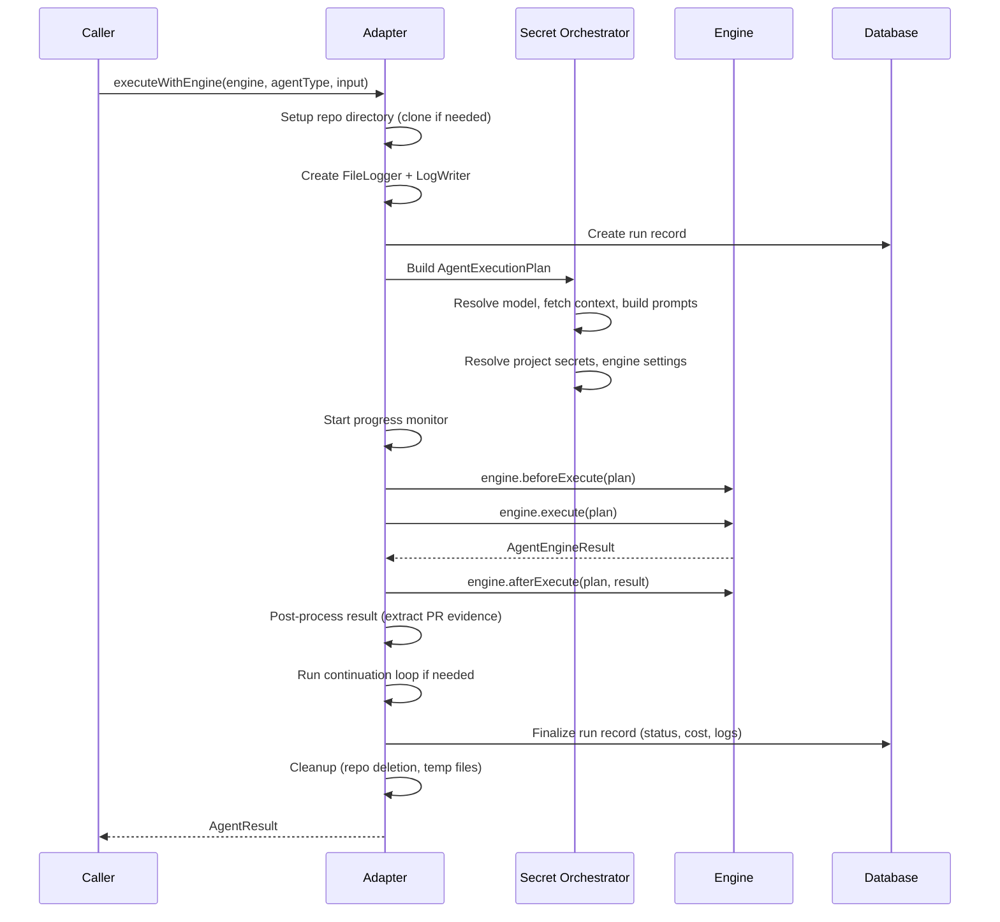

# Engine Backends

CASCADE abstracts LLM execution behind the `AgentEngine` interface. Multiple engines (Claude Code, LLMist, Codex, OpenCode) implement this interface, and a shared execution adapter orchestrates the full lifecycle around any engine.

## AgentEngine Interface

`src/backends/types.ts`

```typescript
interface AgentEngine {
  readonly definition: AgentEngineDefinition;

  execute(plan: AgentExecutionPlan): Promise<AgentEngineResult>;
  supportsAgentType(agentType: string): boolean;

  // Optional hooks
  resolveModel?(cascadeModel: string): string;
  getSettingsSchema?(): ZodType<Record<string, unknown>>;
  beforeExecute?(plan: AgentExecutionPlan): Promise<void>;
  afterExecute?(plan: AgentExecutionPlan, result: AgentEngineResult): Promise<void>;
}
```

### AgentEngineDefinition

Describes engine capabilities and configuration:

```typescript
interface AgentEngineDefinition {
  readonly id: string;              // 'claude-code', 'llmist', 'codex', 'opencode'
  readonly label: string;           // Display name
  readonly archetype: 'sdk' | 'native-tool';
  readonly capabilities: string[];
  readonly modelSelection: { type: 'free-text' } | { type: 'select', options: [...] };
  readonly logLabel: string;
  readonly settings?: AgentEngineSettingsDefinition;
}
```

### AgentExecutionPlan

The fully resolved plan passed to `engine.execute()`, combining context, prompts, and policy:

```typescript
interface AgentExecutionPlan
  extends AgentExecutionContext,   // repoDir, project, agentInput, logWriter, etc.
          AgentPromptSpec,          // systemPrompt, taskPrompt, availableTools, contextInjections
          AgentEnginePolicy {       // maxIterations, model, budgetUsd, engineSettings
  cliToolsDir: string;
  nativeToolShimDir?: string;
  completionRequirements?: CompletionRequirements;
}
```

## Two Engine Archetypes

### `native-tool` — Subprocess-based CLI tools

Used when the engine runs as an external CLI process with its own built-in file/bash tools.

**Base class**: `NativeToolEngine` (`src/backends/shared/NativeToolEngine.ts`)

Provides:
- `buildEngineEnv()` — construct subprocess environment with allowlisted env vars and project secrets
- `resolveModel()` delegation to `resolveEngineModel()`
- `afterExecute()` cleanup for offloaded context files

**Implementations**: Claude Code (`src/backends/claude-code/`), Codex (`src/backends/codex/`), OpenCode (`src/backends/opencode/`)

Native-tool engines invoke CASCADE domain tools (PM, SCM, alerting) via the `cascade-tools` CLI binary through Bash commands. File operations use the engine's built-in tools (Read, Write, Edit, Bash, Glob, Grep).

### `sdk` — In-process SDK integrations

Used when the engine runs in-process and manages its own LLM API calls.

**Implementation**: LLMist (`src/backends/llmist/`)

SDK engines invoke gadgets server-side as synthetic tool calls — the engine calls the gadget function directly and injects the result into the LLM context.

## Engine Registry

`src/backends/registry.ts`

```typescript
function registerEngine(engine: AgentEngine): void;
function getEngine(name: string): AgentEngine;
function getEngineCatalog(): AgentEngineDefinition[];
```

Engines are registered at bootstrap (`src/backends/bootstrap.ts`) before any config loading or webhook processing begins.

### Engine resolution

When an agent runs, the engine is resolved in order:
1. Agent-type override (from `agent_configs.agent_engine` for this project + agent type)
2. Project-level default (`project.agentEngine.default`)
3. Global fallback: `'claude-code'`

## Execution Adapter

`src/backends/adapter.ts` — `executeWithEngine()`

This is the central orchestration function that wraps every engine call. It handles everything that is common across engines:



### Key stages

1. **Repo setup** — Clone repository or use existing working directory
2. **Run record** — Create `agent_runs` database entry with `running` status
3. **Plan building** (`src/backends/secretOrchestrator.ts`) — Resolve model, fetch context injections, build system/task prompts, gather project secrets, merge engine settings
4. **Progress monitoring** (`src/backends/progressMonitor.ts`) — Timer-based progress updates posted to PM card and/or GitHub PR comment
5. **Engine execution** — `beforeExecute()` → `execute()` → `afterExecute()`
6. **Completion verification** (`src/backends/completion.ts`) — Check sidecar files for PR/review/push evidence
7. **Continuation loop** (`src/backends/shared/continuationLoop.ts`) — Re-invoke engine if completion requirements not met
8. **Finalization** — Update run record with status, duration, cost, logs; upload logs

### LLM call logging

`src/backends/shared/llmCallLogger.ts`

All LLM requests and responses are logged to the `agent_run_llm_calls` table, tracking:
- Request/response content
- Token counts (input, output, cached)
- Cost (USD)
- Duration
- Tool calls made

For further details on adding a new engine, see [`docs/adding-engines.md`](../adding-engines.md).
