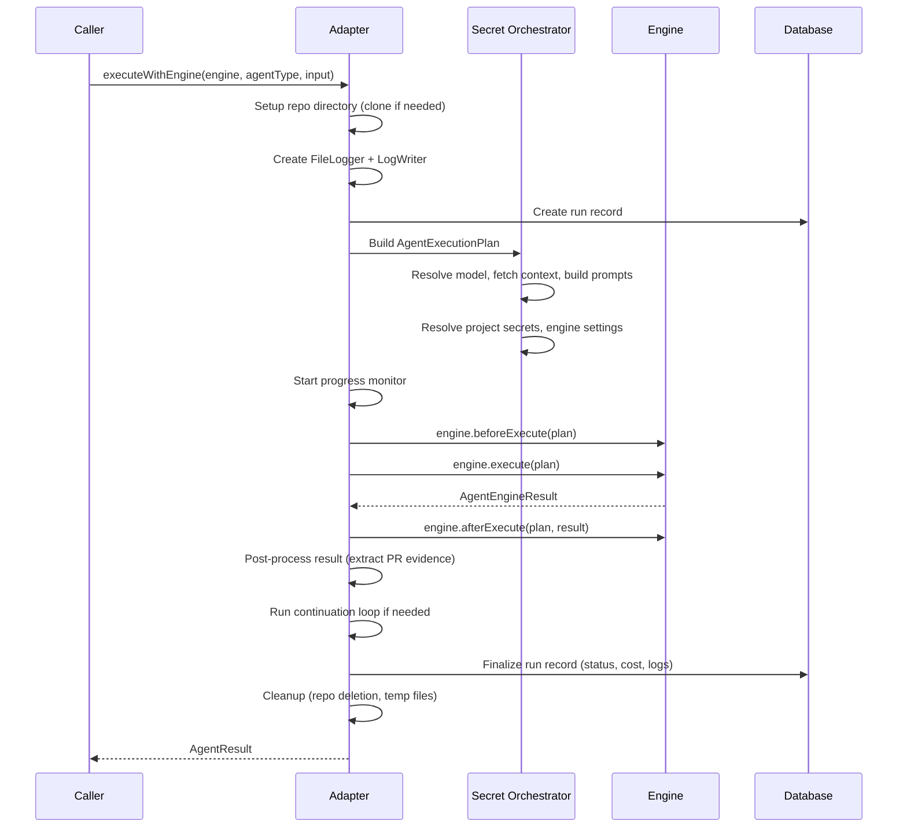

# Engine Backends

CASCADE abstracts LLM execution behind the `AgentEngine` interface. Multiple engines (Claude Code, LLMist, Codex, OpenCode) implement this interface, and a shared execution adapter orchestrates the full lifecycle around any engine.

## AgentEngine Interface

`src/backends/types.ts`

```typescript
interface AgentEngine {
  readonly definition: AgentEngineDefinition;

  execute(plan: AgentExecutionPlan): Promise<AgentEngineResult>;
  supportsAgentType(agentType: string): boolean;

  // Optional hooks
  resolveModel?(cascadeModel: string): string;
  getSettingsSchema?(): ZodType<Record<string, unknown>>;
  beforeExecute?(plan: AgentExecutionPlan): Promise<void>;
  afterExecute?(plan: AgentExecutionPlan, result: AgentEngineResult): Promise<void>;
}
```

### AgentEngineDefinition

Describes engine capabilities and configuration:

```typescript
interface AgentEngineDefinition {
  readonly id: string;              // 'claude-code', 'llmist', 'codex', 'opencode'
  readonly label: string;           // Display name
  readonly archetype: 'sdk' | 'native-tool';
  readonly capabilities: string[];
  readonly modelSelection: { type: 'free-text' } | { type: 'select', options: [...] };
  readonly logLabel: string;
  readonly settings?: AgentEngineSettingsDefinition;
}
```

### AgentExecutionPlan

The fully resolved plan passed to `engine.execute()`, combining context, prompts, and policy:

```typescript
interface AgentExecutionPlan
  extends AgentExecutionContext,   // repoDir, project, agentInput, logWriter, etc.
          AgentPromptSpec,          // systemPrompt, taskPrompt, availableTools, contextInjections
          AgentEnginePolicy {       // maxIterations, model, budgetUsd, engineSettings
  cliToolsDir: string;
  nativeToolShimDir?: string;
  completionRequirements?: CompletionRequirements;
}
```

## Two Engine Archetypes

### `native-tool` — Subprocess-based CLI tools

Used when the engine runs as an external CLI process with its own built-in file/bash tools.

**Base class**: `NativeToolEngine` (`src/backends/shared/NativeToolEngine.ts`)

Provides:
- `buildEngineEnv()` — construct subprocess environment with allowlisted env vars and project secrets
- `resolveModel()` delegation to `resolveEngineModel()`
- `afterExecute()` cleanup for offloaded context files

**Implementations**: Claude Code (`src/backends/claude-code/`), Codex (`src/backends/codex/`), OpenCode (`src/backends/opencode/`)

Native-tool engines invoke CASCADE domain tools (PM, SCM, alerting) via the `cascade-tools` CLI binary through Bash commands. File operations use the engine's built-in tools (Read, Write, Edit, Bash, Glob, Grep).

### `sdk` — In-process SDK integrations

Used when the engine runs in-process and manages its own LLM API calls.

**Implementation**: LLMist (`src/backends/llmist/`)

SDK engines invoke gadgets server-side as synthetic tool calls — the engine calls the gadget function directly and injects the result into the LLM context.

## Engine Registry

`src/backends/registry.ts`

```typescript
function registerEngine(engine: AgentEngine): void;
function getEngine(name: string): AgentEngine;
function getEngineCatalog(): AgentEngineDefinition[];
```

Engines are registered at bootstrap (`src/backends/bootstrap.ts`) before any config loading or webhook processing begins.

### Engine resolution

When an agent runs, the engine is resolved in order:
1. Agent-type override (from `agent_configs.agent_engine` for this project + agent type)
2. Project-level default (`project.agentEngine.default`)
3. Global fallback: `'claude-code'`

## Execution Adapter

`src/backends/adapter.ts` — `executeWithEngine()`

This is the central orchestration function that wraps every engine call. It handles everything that is common across engines:


```mermaid
sequenceDiagram
    participant C as Caller
    participant A as Adapter
    participant S as Secret Orchestrator
    participant E as Engine
    participant D as Database

    C->>A: executeWithEngine(engine, agentType, input)
    A->>A: Setup repo directory (clone if needed)
    A->>A: Create FileLogger + LogWriter
    A->>D: Create run record
    A->>S: Build AgentExecutionPlan
    S->>S: Resolve model, fetch context, build prompts
    S->>S: Resolve project secrets, engine settings
    A->>A: Start progress monitor
    A->>E: engine.beforeExecute(plan)
    A->>E: engine.execute(plan)
    E-->>A: AgentEngineResult
    A->>E: engine.afterExecute(plan, result)
    A->>A: Post-process result (extract PR evidence)
    A->>A: Run continuation loop if needed
    A->>D: Finalize run record (status, cost, logs)
    A->>A: Cleanup (repo deletion, temp files)
    A-->>C: AgentResult
```

### Key stages

1. **Repo setup** — Clone repository or use existing working directory
2. **Run record** — Create `agent_runs` database entry with `running` status
3. **Plan building** (`src/backends/secretOrchestrator.ts`) — Resolve model, fetch context injections, build system/task prompts, gather project secrets, merge engine settings
4. **Progress monitoring** (`src/backends/progressMonitor.ts`) — Timer-based progress updates posted to PM card and/or GitHub PR comment
5. **Engine execution** — `beforeExecute()` → `execute()` → `afterExecute()`
6. **Completion verification** (`src/backends/completion.ts`) — Check sidecar files for PR/review/push evidence
7. **Continuation loop** (`src/backends/shared/continuationLoop.ts`) — Re-invoke engine if completion requirements not met
8. **Finalization** — Update run record with status, duration, cost, logs; upload logs

### LLM call logging

`src/backends/shared/llmCallLogger.ts`

All LLM requests and responses are logged to the `agent_run_llm_calls` table, tracking:
- Request/response content
- Token counts (input, output, cached)
- Cost (USD)
- Duration
- Tool calls made

## Worker-image runtime baseline (MNG-1055)

Native-tool engines do not provision their own shell environment — they execute against whatever the worker image ships. CASCADE intentionally bakes a fixed baseline into `Dockerfile.worker` so agents can rely on these tools without per-project `.cascade/setup.sh` workarounds:

| Tool | Where it lives | Notes |
|---|---|---|
| `python` / `python3` | apt `python3` + `python-is-python3` | Both names resolve to the same Debian-owned Python 3. Use either for `python -c 'import json'` etc.; do not `pip install` at runtime. |
| `jq`, `rg`, `fd`, `git`, `tmux`, `cascade-tools`, `ast-grep` (`sg`) | apt + curl + npm install in the worker image | Prefer these over hand-rolled equivalents in shell commands. |
| Playwright Chromium | `npm install -g @playwright/test@<pin> && playwright install --with-deps chromium` | Browser cache lives at `$PLAYWRIGHT_BROWSERS_PATH` (`/ms-playwright`), readable and writable by the unprivileged `node` user. |
| Agent engine CLIs | `@anthropic-ai/claude-code`, `@openai/codex`, `opencode-ai` | All pinned versions. |

**Env propagation.** Native-tool engines sanitize subprocess env via `src/backends/shared/envFilter.ts`. `PLAYWRIGHT_BROWSERS_PATH` is allowlisted as an exact match so the bake-in cache is reachable from agent shells; the broader `PLAYWRIGHT_*` prefix is intentionally not allowed, preserving the defense-in-depth posture for the rest of Playwright's env surface.

**Smoke coverage.** Every build path validates the baseline via `tests/docker/worker-runtime-tools/run-test.sh`. CI (`.github/workflows/ci.yml` → `docker-build-check`) runs the script against `cascade-worker:ci-check` after `docker build`. The deploy workflows (`.github/workflows/deploy{,-dev}.yml`) run the same script against the freshly built worker image **before** pushing `:latest` / `:dev` / SHA tags, so a regression that would break agents in production blocks the publish step.

**Image size.** Chromium + system deps significantly increase the worker image. We pin one Chromium revision and one `@playwright/test` version; target repositories that need a materially different revision can run their normal `npx playwright install chromium` flow in `.cascade/setup.sh`, which writes the missing revision into the same `$PLAYWRIGHT_BROWSERS_PATH` cache as the runtime `node` user. Other browsers (Firefox, WebKit) are intentionally not installed.

**Agent visibility.** The list of guaranteed tools is surfaced to agents in the native-tool system prompt (`src/backends/shared/nativeToolPrompts.ts`, "Guaranteed runtime tools" section). Adding a new tool to the worker image should always be paired with an update to that section so agents reach for the new capability instead of working around its absence.

For further details on adding a new engine, see [`docs/adding-engines.md`](../adding-engines.md).
