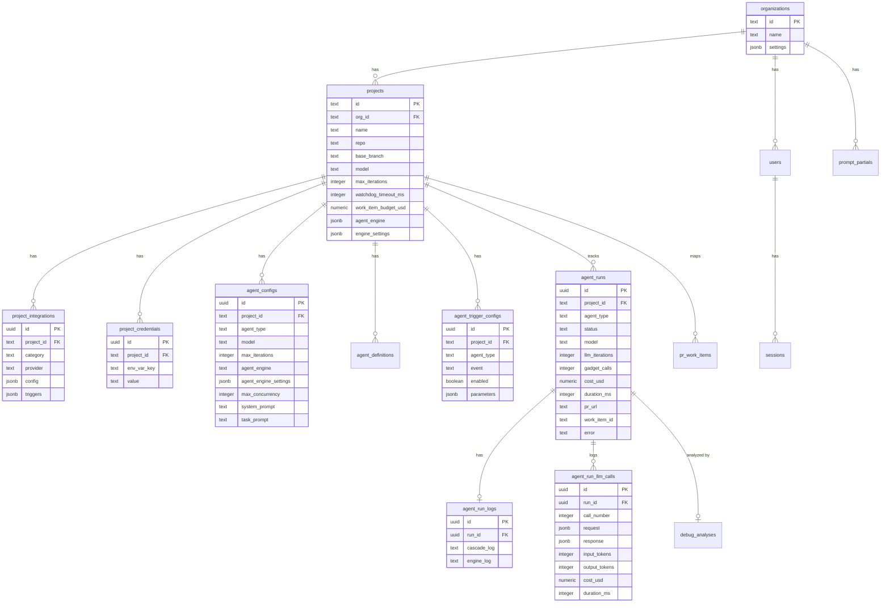

# Database

CASCADE uses PostgreSQL with [Drizzle ORM](https://orm.drizzle.team/) for type-safe database access. All data access goes through repository modules — no raw SQL in application code.

## Schema

`src/db/schema/`

### Key tables

| Table | Purpose | Key constraints |
|-------|---------|-----------------|
| `organizations` | Multi-tenant organization definitions | — |
| `projects` | Per-project config (repo, model, budget, engine) | `repo` UNIQUE |
| `project_integrations` | Integration configs with category/provider | UNIQUE(`project_id`, `category`) |
| `project_credentials` | Encrypted credentials keyed by env var name | UNIQUE(`project_id`, `env_var_key`) |
| `agent_configs` | Per-agent-type overrides per project | UNIQUE(`project_id`, `agent_type`), `project_id NOT NULL` |
| `agent_definitions` | Agent YAML definitions (built-in + custom) | UNIQUE(`agent_type`) |
| `agent_trigger_configs` | Trigger enable/disable + parameters per project/agent/event | UNIQUE(`project_id`, `agent_type`, `event`) |
| `agent_runs` | Agent execution records with status, cost, duration | Indexed on `project_id`, `status`, `started_at` |
| `agent_run_logs` | Cascade log + engine log per run | One-to-one with `agent_runs` |
| `agent_run_llm_calls` | LLM request/response pairs with token/cost tracking | — |
| `prompt_partials` | Org-scoped prompt template customizations | UNIQUE(`org_id`, `name`) |
| `pr_work_items` | Maps PRs to work items for run-link display | — |
| `webhook_logs` | Raw webhook payloads for debugging | — |
| `users` | Dashboard users (email, bcrypt hash, role) | Org-scoped |
| `sessions` | Session tokens for cookie auth (30-day expiry) | — |
| `debug_analyses` | AI debug analysis results | — |

## Repositories

`src/db/repositories/`

Each table has a dedicated repository providing typed query methods. Key repositories:

| Repository | Purpose |
|------------|---------|
| `configRepository` | Load full project config from DB, merge integrations + credentials |
| `configMapper` | Transform raw DB rows to typed `ProjectConfig` objects |
| `credentialsRepository` | Credential CRUD with transparent encryption/decryption |
| `runsRepository` | Run lifecycle (create, update status, query by project/status) |
| `runLogsRepository` | Store and retrieve cascade + engine logs |
| `llmCallsRepository` | Log and query LLM request/response pairs |
| `agentConfigsRepository` | Per-agent settings CRUD |
| `agentDefinitionsRepository` | Agent definition CRUD (YAML ↔ JSONB) |
| `agentTriggerConfigsRepository` | Trigger enable/disable/params per project/agent/event |
| `integrationsRepository` | Query integration configuration |
| `projectsRepository` | Project CRUD |
| `organizationsRepository` | Organization CRUD |
| `usersRepository` | User management |
| `partialsRepository` | Prompt partial CRUD |
| `prWorkItemsRepository` | PR ↔ work item mapping |
| `webhookLogsRepository` | Webhook audit trail |
| `debugAnalysisRepository` | Debug analysis results |

## Connection Management

`src/db/client.ts`

- `DatabaseContext` class wraps Drizzle instance + `pg.Pool`
- `getDb()` returns a singleton, lazily initialized from `DATABASE_URL`
- SSL support with optional CA certificate (`DATABASE_CA_CERT`)
- In workers, the DB connection is initialized eagerly (before env scrub removes `DATABASE_URL`)

## Migrations

Migrations are hand-written SQL files in `src/db/migrations/`, tracked by drizzle-kit's journal (`meta/_journal.json`).

### Adding a migration

1. Create `src/db/migrations/NNNN_description.sql`
2. Add entry to `src/db/migrations/meta/_journal.json` with unique `when` timestamp and `tag` matching filename
3. Run `npm run db:migrate`

### Scripts

| Command | Purpose |
|---------|---------|
| `npm run db:migrate` | Apply pending migrations |
| `npm run db:generate` | Generate migration SQL from schema changes |
| `npm run db:push` | Push schema directly (dev only) |
| `npm run db:studio` | Open Drizzle Studio |
| `npm run db:seed` | Seed from `config/projects.json` |
| `npm run db:bootstrap-journal` | Register existing migrations (one-time for `push`-initialized DBs) |
